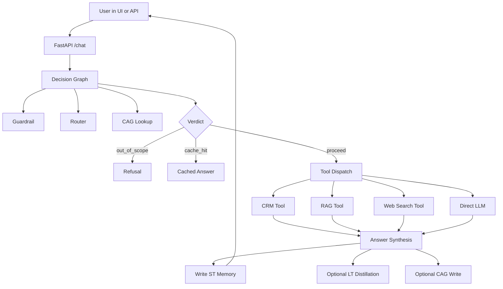
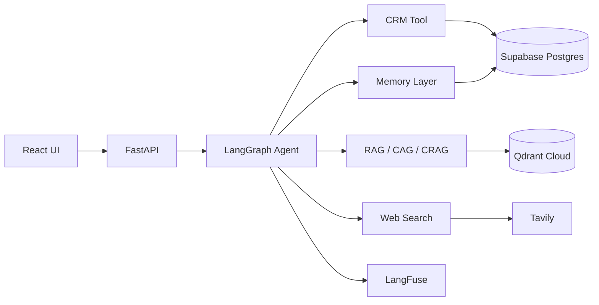
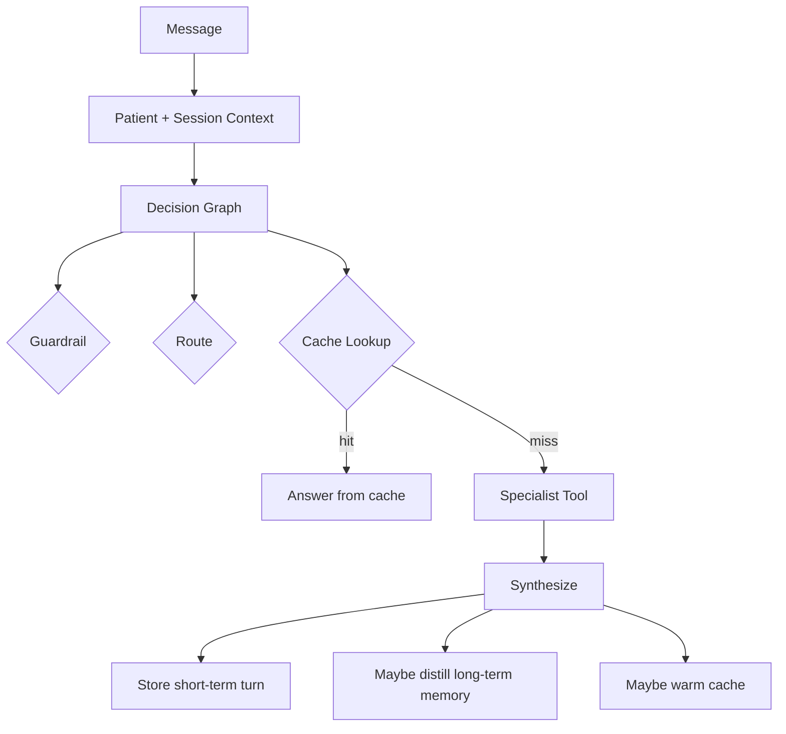
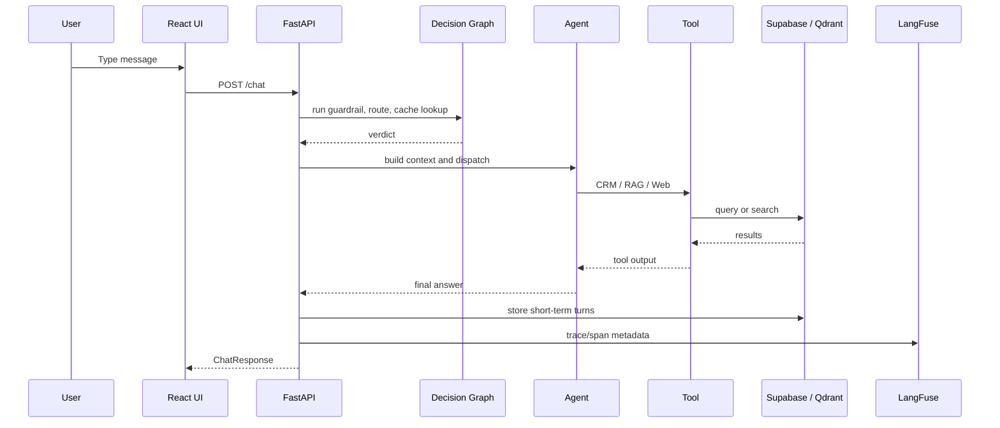
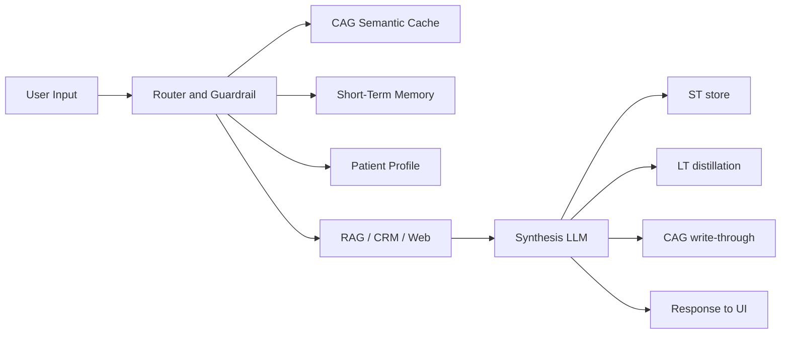
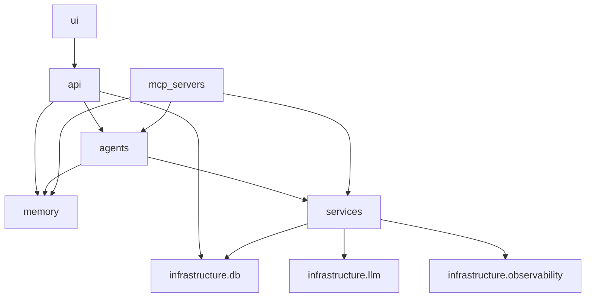
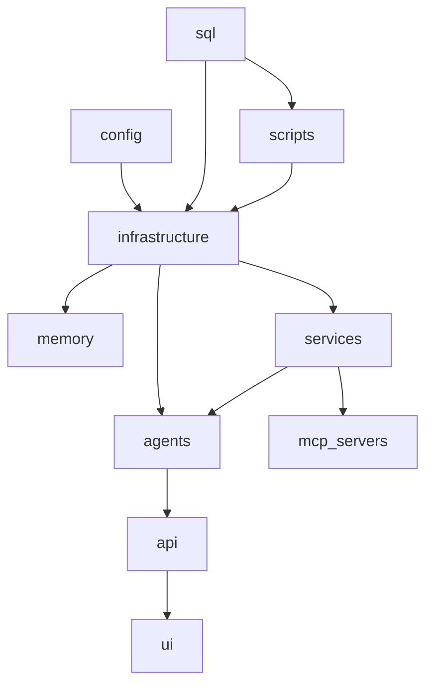

# Week 13 Technical Documentation

## Nawaloka Health Assistant

This document explains the Week 13 project as if you are joining the team for the first time. It covers the runtime architecture, how the agent works, how memory and retrieval are layered, how the API and UI connect, and how the system is deployed and tested.

The fastest way to orient yourself is to start with [src/api/main.py](src/api/main.py), [src/agents/orchestrator.py](src/agents/orchestrator.py), [src/api/routers/chat.py](src/api/routers/chat.py), [src/memory/memory_ops.py](src/memory/memory_ops.py), and [ui/src/App.tsx](ui/src/App.tsx).

---

## 1. Executive Summary

This project is a hospital-focused agentic AI assistant for Nawaloka Hospital. It answers patient questions, looks up appointments, searches internal hospital knowledge, performs live web search when required, remembers user-specific facts, and exposes all of those capabilities both through an AI chat experience and through direct tool endpoints.

It solves a practical problem: patients and staff need one conversational interface that can decide whether to consult the CRM, the hospital knowledge base, a semantic cache, long-term memory, or the live web. The system routes each request to the right pathway instead of forcing every query through one monolithic prompt.

The main workflow is:
1. The user sends a message from the UI or the API.
2. The backend loads session memory and patient context.
3. A decision graph runs guardrail, routing, and cache lookup in parallel.
4. If the request is in scope and not served by cache, the chosen specialist path runs.
5. The answer is synthesized, saved to short-term memory, and optionally distilled into long-term memory.
6. The UI renders the response, route metadata, and timing data.

Main technologies include FastAPI, LangGraph, LangChain, MCP, Supabase PostgreSQL, pgvector, Qdrant, Tavily, LangFuse, React, Vite, Tailwind CSS, and Framer Motion.

Main AI concepts used include intent classification, guardrail classification, semantic caching, retrieval-augmented generation, corrective retrieval, structured output extraction, long-term memory distillation, and multi-route orchestration.

The intended users are patients, demo operators, developers learning agentic AI, and instructors reviewing how to build a production-style routing-and-memory system.

---

## 2. Overall Project Structure

### Project Tree

```text
Week 13/
├── .dockerignore
├── .env.example
├── .gitignore
├── Makefile
├── README.md
├── STUDENT_SETUP_GUIDE.md
├── TECHNICAL_DOCUMENTATION.md
├── config/
├── docker/
├── docker-compose.yml
├── notebooks/
├── pyproject.toml
├── requirements.txt
├── scripts/
├── sql/
├── src/
├── template.py
├── tests/
├── ui/
└── uv.lock
```

### Folder Responsibilities

| Folder | Purpose | Why it exists | Main dependencies |
|---|---|---|---|
| [config](config) | Non-secret runtime configuration | Centralizes model, retrieval, cache, and path settings in YAML | [src/infrastructure/config.py](src/infrastructure/config.py), [src/infrastructure/observability.py](src/infrastructure/observability.py) |
| [docker](docker) | Container build artifacts | Packages the API and UI for local deployment | [docker-compose.yml](docker-compose.yml), [Makefile](Makefile) |
| [notebooks](notebooks) | Teaching and exploration notebooks | Demonstrates routing, memory, and LangGraph behavior interactively | [src/agents/orchestrator.py](src/agents/orchestrator.py), [src/memory/memory_ops.py](src/memory/memory_ops.py) |
| [scripts](scripts) | Operational utilities | Seeds the database, builds indexes, tests integrations, and prepares cache | [src/infrastructure/db](src/infrastructure/db), [src/services](src/services) |
| [sql](sql) | SQL seed and schema files | Defines the Supabase schema and deterministic seed data | [src/infrastructure/db/supabase_client.py](src/infrastructure/db/supabase_client.py), [scripts/init_supabase.py](scripts/init_supabase.py) |
| [src](src) | Backend source code | Contains API, agents, memory, services, infrastructure, and MCP servers | Almost everything else |
| [tests](tests) | Minimal memory tests | Verifies memory scoring and pruning policies | [src/memory/policies.py](src/memory/policies.py) |
| [ui](ui) | React front end | Provides the chat interface, tool explorer, and status panels | [src/api](src/api), [src/api/routers/chat.py](src/api/routers/chat.py) |

### Why the tree is organized this way

The repository separates domain logic from transport and infrastructure. The agent, memory, retrieval, and tool code live in `src/`. API routers, MCP servers, and UI are thin orchestration layers around those shared services. This means the same capabilities can be invoked through the chat flow, the REST endpoints, or MCP without duplicating business logic.

---

## 3. Folder-by-Folder Explanation

### Root Files

| File | Purpose | Notes |
|---|---|---|
| [.dockerignore](.dockerignore) | Prevents unnecessary files from entering Docker build contexts | Keeps images smaller and builds faster |
| [.env.example](.env.example) | Template for secrets and environment variables | Documents required keys for Supabase, Qdrant, LLM providers, Tavily, and LangFuse |
| [.gitignore](.gitignore) | Ignores generated and local-only files | Standard repo hygiene |
| [Makefile](Makefile) | Developer command entry point | Provides install, seed, ingest, test, and demo targets |
| [README.md](README.md) | Project overview | Contains a shorter, high-level version of the architecture |
| [STUDENT_SETUP_GUIDE.md](STUDENT_SETUP_GUIDE.md) | Student-oriented Docker setup guide | Operational runbook for the full stack |
| [TECHNICAL_DOCUMENTATION.md](TECHNICAL_DOCUMENTATION.md) | This document | Comprehensive technical reference |
| [pyproject.toml](pyproject.toml) | Python packaging and tool config | Declares dependencies, linting, formatting, and test settings |
| [requirements.txt](requirements.txt) | Dependency list for direct pip installs | Mirrors the project dependencies for workshop use |
| [template.py](template.py) | Legacy scaffold generator | Not used by the running app; kept as a reference for future project bootstraps |
| [uv.lock](uv.lock) | Locked dependency resolution | Generated artifact for reproducible installs |
| [docker-compose.yml](docker-compose.yml) | Two-service deployment definition | Builds the API and UI containers |

### [config](config)

This folder controls model choice, retrieval thresholds, chunking settings, cache behavior, and FAQ warm-start data. It exists so the system can be tuned without editing code.

| File | Purpose | Key dependencies |
|---|---|---|
| [config/param.yaml](config/param.yaml) | Runtime parameters | Read by [src/infrastructure/config.py](src/infrastructure/config.py) |
| [config/models.yaml](config/models.yaml) | Provider-specific model mapping | Used by model selection helpers in [src/infrastructure/config.py](src/infrastructure/config.py) |
| [config/faqs.yaml](config/faqs.yaml) | Hardcoded FAQ seed data | Warmed into CAG at startup by [src/api/main.py](src/api/main.py) and cache rebuild scripts |

Why it exists: the project has many thresholds and model choices. Pulling them into YAML makes the system explainable and easier to retune for another deployment.

### [docker](docker)

This folder packages the application for local containerized runs.

| File | Purpose |
|---|---|
| [docker/api/Dockerfile](docker/api/Dockerfile) | Builds the FastAPI backend image |
| [docker/web/Dockerfile](docker/web/Dockerfile) | Builds the static UI plus nginx image |
| [docker/web/nginx.conf](docker/web/nginx.conf) | Serves the built UI and proxies API calls |

Why it exists: the project ships as a teaching/demo stack with one container for the API and one for the browser-facing UI.

### [notebooks](notebooks)

The notebooks are the teaching layer. They let a learner step through routing, memory, and LangGraph behavior interactively rather than only reading source code.

| File | Purpose |
|---|---|
| [notebooks/01_routing_memory_and_tools.ipynb](notebooks/01_routing_memory_and_tools.ipynb) | Explains routing, memory, and tool behavior |
| [notebooks/02_multi_agent_langgraph.ipynb](notebooks/02_multi_agent_langgraph.ipynb) | Demonstrates LangGraph orchestration and multi-agent fan-out |

### [scripts](scripts)

These are operational entry points. They seed data, initialize schemas, test integrations, and rebuild caches.

| File | Purpose |
|---|---|
| [scripts/build_guidelines.py](scripts/build_guidelines.py) | Generates Word documentation guides for the project |
| [scripts/check_patient_uniques.py](scripts/check_patient_uniques.py) | Audits and optionally adds uniqueness constraints for patients |
| [scripts/ingest_to_qdrant.py](scripts/ingest_to_qdrant.py) | CLI wrapper for the Qdrant ingestion pipeline |
| [scripts/init_chat_sessions.py](scripts/init_chat_sessions.py) | Initializes chat session records and related tables |
| [scripts/init_supabase.py](scripts/init_supabase.py) | Creates the Supabase schema from the dynamic DDL |
| [scripts/rebuild_cag_cache.py](scripts/rebuild_cag_cache.py) | Clears and repopulates the semantic cache from FAQ data |
| [scripts/seed_crm_unified.py](scripts/seed_crm_unified.py) | Seeds doctors, patients, specialties, bookings, and related CRM data |
| [scripts/seed_procedures.py](scripts/seed_procedures.py) | Seeds procedural memory workflows |
| [scripts/test_langgraph.py](scripts/test_langgraph.py) | Demonstrates the direct LangGraph multi-turn agent |
| [scripts/test_mcp_agent.py](scripts/test_mcp_agent.py) | Demonstrates the MCP-backed LangGraph agent |
| [scripts/test_supabase.py](scripts/test_supabase.py) | Verifies Supabase connectivity and pgvector support |

Why it exists: these scripts separate data preparation and validation from runtime logic. That is a good pattern for any agentic system that depends on external infrastructure.

### [sql](sql)

This folder is the database source of truth for schema and seed data.

| File | Purpose |
|---|---|
| [sql/supabase_schema.sql](sql/supabase_schema.sql) | Dynamic schema DDL for memory and CRM tables |
| [sql/01_specialties.sql](sql/01_specialties.sql) | Seed data for specialties |
| [sql/02_locations.sql](sql/02_locations.sql) | Seed data for locations |
| [sql/03_doctors.sql](sql/03_doctors.sql) | Seed data for doctors |
| [sql/04_patients.sql](sql/04_patients.sql) | Seed data for patients |
| [sql/05_bookings.sql](sql/05_bookings.sql) | Seed data for bookings |
| [sql/06_procedures.sql](sql/06_procedures.sql) | Seed data for procedural memory |
| [sql/07_chat_sessions.sql](sql/07_chat_sessions.sql) | Schema for chat session metadata |

Why it exists: the project uses SQL to create a deterministic, inspectable backend state. That makes the system easier to reproduce in workshop settings.

### [src](src)

The `src/` tree is the real application. It is divided into `api`, `agents`, `memory`, `services`, `infrastructure`, and `mcp_servers` so each layer has a clear responsibility.

---

### [src/api](src/api)

The API layer is the HTTP transport surface. It contains app startup, dependency injection, schemas, middleware, and the routers.

| File | Purpose | Notes |
|---|---|---|
| [src/api/__init__.py](src/api/__init__.py) | Package marker | Empty |
| [src/api/main.py](src/api/main.py) | FastAPI application, lifespan warmup, router registration | Builds the agent, caches the embedder, prewarms prompts and cache, and mounts routers |
| [src/api/run.py](src/api/run.py) | Uvicorn launcher | Convenience entry point for local runs |
| [src/api/deps.py](src/api/deps.py) | Dependency helpers | Pulls shared objects from `app.state` and returns 503 until startup completes |
| [src/api/schemas.py](src/api/schemas.py) | Pydantic request/response models | Mirrors the backend contract for chat, tools, patients, memory, and system endpoints |
| [src/api/middleware.py](src/api/middleware.py) | Request context and error middleware | Adds request IDs, latency headers, and clean JSON 500s |
| [src/api/utils.py](src/api/utils.py) | Shared router helpers | Normalizes and formats Sri Lankan phone numbers |
| [src/api/event_labels.py](src/api/event_labels.py) | Human-readable stage and tool labels | Used by SSE and the UI timeline |
| [src/api/routers/chat.py](src/api/routers/chat.py) | Main chat flow | Implements /chat, /chat/stream, /chat/reset, /sessions/warmup, and /sessions/{id}/turns |
| [src/api/routers/chat_sessions.py](src/api/routers/chat_sessions.py) | Chat session metadata API | Manages sidebar session rows, rename, archive, delete, and touch behavior |
| [src/api/routers/health.py](src/api/routers/health.py) | Health and config endpoints | Exposes /health, /ready, and /config |
| [src/api/routers/patients.py](src/api/routers/patients.py) | Patient identity endpoints | Phone-based lookup/register/update without formal auth |
| [src/api/routers/tools/__init__.py](src/api/routers/tools/__init__.py) | Package marker | Empty |
| [src/api/routers/tools/crm.py](src/api/routers/tools/crm.py) | CRM tool endpoints | Direct REST wrappers around CRM actions |
| [src/api/routers/tools/rag.py](src/api/routers/tools/rag.py) | RAG tool endpoints | Direct REST wrappers around retrieval/generation and stats |
| [src/api/routers/tools/web.py](src/api/routers/tools/web.py) | Web search endpoint | Tavily-backed live search |
| [src/api/routers/tools/cag.py](src/api/routers/tools/cag.py) | Semantic cache endpoint | Get, set, stats, clear |
| [src/api/routers/tools/memory.py](src/api/routers/tools/memory.py) | Memory endpoints | Recall, list facts, store fact, distill |
| [src/api/routers/tools/crawl.py](src/api/routers/tools/crawl.py) | Crawler endpoint | Playwright-based BFS crawl wrapper |

Design note: `src/api/main.py` wires the application around a lifespan hook. That hook is important because it allows heavyweight objects such as LLM clients, Qdrant, the local embedder, and the agent orchestrator to be created once and reused.

---

### [src/agents](src/agents)

The agents layer is the decision-making core. It contains the LangGraph orchestrator, routing logic, guardrails, prompts, and tool adapters.

| File | Purpose | Notes |
|---|---|---|
| [src/agents/__init__.py](src/agents/__init__.py) | Public package exports | Re-exports the orchestrator and router classes |
| [src/agents/state.py](src/agents/state.py) | Shared LangGraph state schema | Defines the conveyor-belt state used by all nodes |
| [src/agents/router.py](src/agents/router.py) | Intent classifier | Produces multi-route decisions from an LLM JSON response |
| [src/agents/guardrail.py](src/agents/guardrail.py) | Scope classifier | Rejects out-of-domain queries before tools are used |
| [src/agents/decision_graph.py](src/agents/decision_graph.py) | Parallel classifier graph | Runs guardrail, router, and cache lookup in parallel and computes a verdict |
| [src/agents/orchestrator.py](src/agents/orchestrator.py) | LangGraph orchestration and build factories | Builds the standard agent and the MCP-backed variant |
| [src/agents/prompts/__init__.py](src/agents/prompts/__init__.py) | Package marker | Empty |
| [src/agents/prompts/agent_prompts.py](src/agents/prompts/agent_prompts.py) | Agent prompt templates and builders | Fetches prompts from LangFuse with local fallback text |
| [src/agents/tools/__init__.py](src/agents/tools/__init__.py) | Tool exports | Re-exports CRM, RAG, and web tools |
| [src/agents/tools/crm_tool.py](src/agents/tools/crm_tool.py) | CRM domain tool | Appointment lookup, doctor search, booking CRUD, reference lists |
| [src/agents/tools/rag_tool.py](src/agents/tools/rag_tool.py) | Internal KB tool | CAG + CRAG + Qdrant retrieval wrapper |
| [src/agents/tools/web_search_tool.py](src/agents/tools/web_search_tool.py) | Live web search tool | Tavily-powered real-time search |

Why it exists: this layer makes the project agentic rather than just chatbot-like. It decides what to do, not just how to phrase a response.

---

### [src/memory](src/memory)

The memory layer implements the four-tier memory design: short-term turns, long-term semantic facts, episodic memory, and procedural workflows.

| File | Purpose | Notes |
|---|---|---|
| [src/memory/__init__.py](src/memory/__init__.py) | Public exports | Re-exports schemas, stores, and operations |
| [src/memory/schemas.py](src/memory/schemas.py) | Memory dataclasses and protocols | Defines conversation turns, facts, episodes, procedures, and store interfaces |
| [src/memory/prompts.py](src/memory/prompts.py) | Distillation and recall prompts | LangFuse-backed prompt builders with local fallbacks |
| [src/memory/policies.py](src/memory/policies.py) | Memory scoring and pruning policy | Pure functions for scoring, decay, pruning, and deduplication |
| [src/memory/st_store.py](src/memory/st_store.py) | Short-term memory store | Ring buffer in Supabase `st_turns` |
| [src/memory/lt_store.py](src/memory/lt_store.py) | Long-term semantic memory store | pgvector-backed fact storage and semantic search |
| [src/memory/episodic_store.py](src/memory/episodic_store.py) | Episodic store | Stores and retrieves full conversation episodes |
| [src/memory/procedural_store.py](src/memory/procedural_store.py) | Procedural store | Stores step-by-step workflows and semantic retrieval |
| [src/memory/memory_ops.py](src/memory/memory_ops.py) | Distiller, recaller, forget service | Coordinates the write path, read path, and cleanup path |

Why it exists: memory is not just conversation history. The project differentiates what was recently said, what should be remembered long term, and what operational procedure might help next time.

---

### [src/services](src/services)

Services hold domain logic that is shared by the API, MCP servers, and scripts.

| File | Purpose | Notes |
|---|---|---|
| [src/services/__init__.py](src/services/__init__.py) | Package marker | Empty |
| [src/services/chat_service/__init__.py](src/services/chat_service/__init__.py) | Chat service exports | Re-exports CAG, CRAG, RAG, and cache classes |
| [src/services/chat_service/cag_cache.py](src/services/chat_service/cag_cache.py) | Qdrant semantic cache | Implements similarity-based query/answer caching |
| [src/services/chat_service/cag_service.py](src/services/chat_service/cag_service.py) | CAG pipeline | Cache-first generation with CRAG fallback and cache warming |
| [src/services/chat_service/crag_service.py](src/services/chat_service/crag_service.py) | Corrective RAG | Confidence-gated retrieval with expanded search on low confidence |
| [src/services/chat_service/rag_service.py](src/services/chat_service/rag_service.py) | RAG service | LangChain retriever and LCEL answer generation |
| [src/services/chat_service/rag_templates.py](src/services/chat_service/rag_templates.py) | Prompt template strings | System and answer templates for KB synthesis |
| [src/services/crm_service/__init__.py](src/services/crm_service/__init__.py) | CRM service exports | Re-exports the database client and data generator |
| [src/services/crm_service/crm_db_client.py](src/services/crm_service/crm_db_client.py) | CRM query client | Joins bookings, patients, doctors, locations, and specialties |
| [src/services/crm_service/llm_data_generator.py](src/services/crm_service/llm_data_generator.py) | Synthetic CRM data generator | Generates realistic Sri Lankan names, notes, and appointment reasons |
| [src/services/ingest_service/__init__.py](src/services/ingest_service/__init__.py) | Ingest service exports | Re-exports chunkers, crawler, and pipeline |
| [src/services/ingest_service/chunkers.py](src/services/ingest_service/chunkers.py) | Document chunking strategies | Semantic, fixed, sliding, parent-child, and late chunking |
| [src/services/ingest_service/pipeline.py](src/services/ingest_service/pipeline.py) | Qdrant ingestion pipeline | Load, chunk, embed, and upsert |
| [src/services/ingest_service/web_crawler.py](src/services/ingest_service/web_crawler.py) | Playwright crawler | BFS crawl and markdown extraction for website content |

Why it exists: these modules separate domain workflow from transport. The same service can be invoked by the agent, a REST route, an MCP server, or a script.

---

### [src/infrastructure](src/infrastructure)

Infrastructure contains configuration, clients, logging, embeddings, and observability. It is intentionally boring and reusable.

| File | Purpose | Notes |
|---|---|---|
| [src/infrastructure/__init__.py](src/infrastructure/__init__.py) | Convenience exports | Exposes LLM and observability helpers |
| [src/infrastructure/config.py](src/infrastructure/config.py) | Central runtime configuration | Reads YAML and derives model, embedding, retrieval, cache, and path constants |
| [src/infrastructure/models.py](src/infrastructure/models.py) | Core document/chunk/evidence models | Dataclasses for ingestion and retrieval metadata |
| [src/infrastructure/utils.py](src/infrastructure/utils.py) | RAG utilities | Document formatting, confidence scoring, citation extraction, truncation |
| [src/infrastructure/log.py](src/infrastructure/log.py) | Logging configuration | Loguru setup and stdlib interception |
| [src/infrastructure/observability.py](src/infrastructure/observability.py) | LangFuse integration | Tracing, prompt management, metadata updates, flush support |
| [src/infrastructure/llm/__init__.py](src/infrastructure/llm/__init__.py) | LLM exports | Re-exports model factories and embedding factory |
| [src/infrastructure/llm/llm_provider.py](src/infrastructure/llm/llm_provider.py) | LLM factory functions | Builds router, fast chat, extractor, and chat models |
| [src/infrastructure/llm/embeddings.py](src/infrastructure/llm/embeddings.py) | Embedding factory functions | Default remote embeddings plus local sentence-transformers embedder |
| [src/infrastructure/db/__init__.py](src/infrastructure/db/__init__.py) | Database client exports | Re-exports Supabase and Qdrant helpers |
| [src/infrastructure/db/sql_client.py](src/infrastructure/db/sql_client.py) | SQLAlchemy engine/session and memory tables | Defines the canonical Supabase connection and memory table metadata |
| [src/infrastructure/db/supabase_client.py](src/infrastructure/db/supabase_client.py) | Supabase REST/SQL helpers | Creates client, tests connectivity, initializes schema, validates pgvector |
| [src/infrastructure/db/supabase_schema.py](src/infrastructure/db/supabase_schema.py) | Dynamic schema generator | Produces the DDL string from config values |
| [src/infrastructure/db/crm_models.py](src/infrastructure/db/crm_models.py) | CRM ORM models | Defines Location, Specialty, Doctor, Patient, ChatSession, and Booking |
| [src/infrastructure/db/crm_init.py](src/infrastructure/db/crm_init.py) | CRM schema checker | Verifies that the CRM tables exist |
| [src/infrastructure/db/qdrant_client.py](src/infrastructure/db/qdrant_client.py) | Qdrant client and collection helpers | Handles collection creation, upsert, search, and auto-ingest |

Why it exists: if you swap providers or change vector infrastructure, this is where most of the plumbing changes should stay isolated.

---

### [src/mcp_servers](src/mcp_servers)

MCP servers expose the existing codebase through the Model Context Protocol. They do not implement new business logic; they wrap existing tools so any MCP client can call them.

| File | Purpose | Notes |
|---|---|---|
| [src/mcp_servers/__init__.py](src/mcp_servers/__init__.py) | Package documentation | Explains the seven-server MCP setup |
| [src/mcp_servers/mcp_config.py](src/mcp_servers/mcp_config.py) | MCP launch config | Defines the stdio subprocess configuration used by the MCP client |
| [src/mcp_servers/crm_server.py](src/mcp_servers/crm_server.py) | CRM MCP server | Wraps CRMTool actions as MCP tools |
| [src/mcp_servers/memory_server.py](src/mcp_servers/memory_server.py) | Memory MCP server | Exposes recall, store, and list operations for memory |
| [src/mcp_servers/rag_server.py](src/mcp_servers/rag_server.py) | KB MCP server | Exposes hospital KB search and cache controls |
| [src/mcp_servers/web_server.py](src/mcp_servers/web_server.py) | Web search MCP server | Exposes Tavily live search |
| [src/mcp_servers/cag_server.py](src/mcp_servers/cag_server.py) | CAG MCP server | Exposes get, set, stats, and clear for the semantic cache |
| [src/mcp_servers/crawler_server.py](src/mcp_servers/crawler_server.py) | Crawler MCP server | Exposes the Playwright crawler as an async tool |

Why it exists: the project demonstrates how to turn a standard tool stack into reusable MCP services without changing the core agent design.

---

### [tests](tests)

| File | Purpose | Notes |
|---|---|---|
| [tests/__init__.py](tests/__init__.py) | Package marker | Empty |
| [tests/test_memory_core.py](tests/test_memory_core.py) | Placeholder memory tests | Stubs for store and recall behavior |
| [tests/test_memory_policies.py](tests/test_memory_policies.py) | Memory policy tests | Verifies scoring, decay, and pruning logic |

Why it exists: the tests are intentionally narrow and focus on the pure policy layer where meaningful assertions can be made without external services.

---

### [ui](ui)

The UI is a separate React application with its own package manifest and build toolchain.

| File | Purpose | Notes |
|---|---|---|
| [ui/README.md](ui/README.md) | UI-specific runbook | Explains the front end architecture and usage |
| [ui/package.json](ui/package.json) | Frontend dependency manifest | Lists React, Vite, Tailwind, Framer Motion, and markdown packages |
| [ui/package-lock.json](ui/package-lock.json) | Locked npm dependency tree | Generated artifact |
| [ui/index.html](ui/index.html) | Vite HTML entry | Mount point for the React app |
| [ui/postcss.config.js](ui/postcss.config.js) | PostCSS config | Tailwind processing |
| [ui/tailwind.config.ts](ui/tailwind.config.ts) | Tailwind theme | Defines the dark palette, motion, and typography |
| [ui/tsconfig.json](ui/tsconfig.json) | TypeScript config | UI type checking |
| [ui/tsconfig.node.json](ui/tsconfig.node.json) | Vite node-side TypeScript config | Build tooling support |
| [ui/tsconfig.node.tsbuildinfo](ui/tsconfig.node.tsbuildinfo) | Generated TS build cache | Generated artifact |
| [ui/tsconfig.tsbuildinfo](ui/tsconfig.tsbuildinfo) | Generated TS build cache | Generated artifact |
| [ui/vite.config.ts](ui/vite.config.ts) | Vite dev server config | Proxies `/api` to the FastAPI backend |
| [ui/vite.config.js](ui/vite.config.js) | Built JS version of the Vite config | Generated artifact |
| [ui/vite.config.d.ts](ui/vite.config.d.ts) | TS declarations for the Vite config | Generated artifact |
| [ui/.env.example](ui/.env.example) | Frontend environment template | Documents `VITE_API_URL` and related settings |
| [ui/.gitignore](ui/.gitignore) | UI ignore rules | Standard frontend hygiene |
| [ui/src/main.tsx](ui/src/main.tsx) | React entry point | Creates the app root |
| [ui/src/App.tsx](ui/src/App.tsx) | Main shell | Orchestrates session warmup, patient gate, sidebar, chat, and profile sheet |
| [ui/src/api/client.ts](ui/src/api/client.ts) | Fetch wrapper | Centralizes every REST call and SSE streaming logic |
| [ui/src/types.ts](ui/src/types.ts) | Shared frontend types | Mirrors backend schemas and stream events |
| [ui/src/index.css](ui/src/index.css) | Global styling | Tailwind layers, component styles, and markdown table rendering |
| [ui/src/hooks/useHealth.ts](ui/src/hooks/useHealth.ts) | Health polling hook | Polls `/health`, fetches `/config`, and refreshes `/ready` on transitions |
| [ui/src/hooks/usePatient.ts](ui/src/hooks/usePatient.ts) | Patient identity hook | Handles localStorage persistence and phone-based login/register |
| [ui/src/hooks/useSessions.ts](ui/src/hooks/useSessions.ts) | Session registry hook | Loads, creates, renames, and deletes server-backed chat sessions |
| [ui/src/hooks/useChat.ts](ui/src/hooks/useChat.ts) | Non-streaming chat hook | Sends `/chat` requests and simulates request stages |
| [ui/src/hooks/useChatStream.ts](ui/src/hooks/useChatStream.ts) | Streaming chat hook | Consumes `/chat/stream` SSE and builds the live thought timeline |
| [ui/src/components/ChatWindow.tsx](ui/src/components/ChatWindow.tsx) | Chat transcript view | Renders user and assistant bubbles and the empty state |
| [ui/src/components/InputBox.tsx](ui/src/components/InputBox.tsx) | Message composer | Handles enter-to-send and reset |
| [ui/src/components/MessageBubble.tsx](ui/src/components/MessageBubble.tsx) | Message rendering | Markdown rendering plus response metadata |
| [ui/src/components/ThinkingStages.tsx](ui/src/components/ThinkingStages.tsx) | Simulated stage timeline | Animated five-stage progress strip for the non-streaming chat path |
| [ui/src/components/ChainOfThought.tsx](ui/src/components/ChainOfThought.tsx) | SSE thought timeline | Live stage and tool events during streaming chat |
| [ui/src/components/ResponseMeta.tsx](ui/src/components/ResponseMeta.tsx) | Post-response metadata panel | Shows route, cache hit, latency, trace id, and per-stage timings |
| [ui/src/components/Sidebar.tsx](ui/src/components/Sidebar.tsx) | Session and tool sidebar | Shows patient identity, sessions, and the tool explorer tab |
| [ui/src/components/ToolExplorer.tsx](ui/src/components/ToolExplorer.tsx) | Direct tool explorer | Lets you call CRM, RAG, Web, CAG, and Memory endpoints manually |
| [ui/src/components/PatientGate.tsx](ui/src/components/PatientGate.tsx) | Phone-based gate | Performs lookup or registration before entering chat |
| [ui/src/components/ProfileSheet.tsx](ui/src/components/ProfileSheet.tsx) | Patient profile editor | Edits optional email and notes fields |
| [ui/src/components/StatusBar.tsx](ui/src/components/StatusBar.tsx) | Health/config status chip | Shows backend health, readiness, and active model names |

Why it exists: the UI is deliberately thin. It does not hold business logic; it displays and exercises the backend capabilities in a polished demo interface.

---

## 4. File-by-File Explanation

This section expands the most important source files into their runtime responsibilities.

### Backend Entry and Transport

#### [src/api/main.py](src/api/main.py)
This is the application root. It loads environment variables, installs middleware, builds the FastAPI application, wires routers, and defines the lifespan function that warms the entire system before traffic is accepted.

Important responsibilities:
- Creates the agent once, not per request.
- Builds and caches both the standard embedder and the local CAG embedder.
- Clears stale CAG data on startup so FAQ seeds are deterministic.
- Prefetches LangFuse prompts.
- Warms the router LLM, fast LLM, and embedder.
- Seeds the semantic cache with FAQ and reference answers.
- Stores shared singletons on `app.state`.

Dependencies:
- Calls [src/agents/orchestrator.py](src/agents/orchestrator.py)
- Uses [src/infrastructure/observability.py](src/infrastructure/observability.py)
- Uses [src/services/chat_service/cag_cache.py](src/services/chat_service/cag_cache.py)
- Mounts [src/api/routers/chat.py](src/api/routers/chat.py), [src/api/routers/patients.py](src/api/routers/patients.py), and the tool routers.

#### [src/api/run.py](src/api/run.py)
A small Uvicorn launcher. It exists so the backend can be started with `python -m api.run` or `python src/api/run.py` without remembering the full Uvicorn command.

#### [src/api/middleware.py](src/api/middleware.py)
Adds request IDs and latency headers and converts uncaught exceptions into JSON responses with a request id. This is the cross-cutting observability layer for all HTTP requests.

#### [src/api/deps.py](src/api/deps.py)
The dependency-injection shim. Every heavy object is fetched from `request.app.state`. If startup has not completed, the router returns 503 instead of failing with a `None` error.

#### [src/api/utils.py](src/api/utils.py)
Contains phone-number normalization and display helpers. The system stores a canonical digits-only value for lookup and a `+` display form for the UI.

#### [src/api/schemas.py](src/api/schemas.py)
The backend contract. It defines request and response models for chat, health, sessions, CRM, RAG, web search, CAG, memory, crawler, and patients. The frontend mirrors these types in [ui/src/types.ts](ui/src/types.ts).

#### [src/api/event_labels.py](src/api/event_labels.py)
Maps internal stage and tool identifiers to readable labels shown in the UI timeline and SSE stream.

---

### Chat Flow

#### [src/api/routers/chat.py](src/api/routers/chat.py)
This is the highest-value transport file in the project. It is the request lifecycle for a single chat message.

What it does:
- Accepts `user_id`, `session_id`, and `message`.
- Runs guardrail, route classification, and CAG lookup in parallel through the decision graph.
- Builds patient context, recent session context, and booking context.
- Short-circuits on guardrail failure or cache hit.
- Dispatches to CRM, RAG, direct, or web search when needed.
- Synthesizes the final answer.
- Writes the turn pair back to short-term memory.
- Optionally distills long-term memory.
- Optionally warms the semantic cache.
- Exposes a streaming SSE endpoint that emits stage and tool events.
- Exposes `/chat/reset`, `/sessions/warmup`, and `/sessions/{id}/turns`.

Core helpers worth knowing:
- `_fetch_patient_sync()` loads the full patient profile.
- `_fetch_upcoming_bookings_sync()` fetches the future bookings used to resolve references like “this appointment”.
- `_dispatch_tool()` routes a single decision to CRM, RAG, or web.
- `_run_chat_pipeline()` performs the full orchestration.

Dependencies:
- [src/agents/decision_graph.py](src/agents/decision_graph.py)
- [src/agents/orchestrator.py](src/agents/orchestrator.py)
- [src/memory/st_store.py](src/memory/st_store.py)
- [src/api/routers/chat_sessions.py](src/api/routers/chat_sessions.py)
- [src/api/event_labels.py](src/api/event_labels.py)

#### [src/api/routers/chat_sessions.py](src/api/routers/chat_sessions.py)
Manages the session metadata that powers the sidebar. The database table is `chat_sessions`, while the actual conversation turns live in `st_turns`.

Important behavior:
- Lists sessions newest-first.
- Creates a session if one does not exist.
- Updates title or archived state.
- Deletes a session and cascades its short-term turns.
- Touches the session timestamp after a successful reply.

#### [src/api/routers/health.py](src/api/routers/health.py)
Provides liveness, readiness, and configuration endpoints.

- `/health` answers quickly and only checks whether the app has initialized.
- `/ready` actively probes Qdrant, Supabase, and tool availability.
- `/config` reports non-secret model and provider settings.

#### [src/api/routers/patients.py](src/api/routers/patients.py)
Implements phone-based identity. It is not a full auth system, just a lightweight patient gate for the workshop.

Important behavior:
- Normalizes phone numbers before lookup or registration.
- Uses `external_user_id` as the lookup key.
- Returns 409 when a phone is already registered.
- Invalidates in-memory session caches when profile fields change.

#### [src/api/routers/tools/crm.py](src/api/routers/tools/crm.py)
Each endpoint is a thin async wrapper around the CRM tool. The point is to expose the same functionality to the browser and to MCP clients without duplicating SQL logic.

#### [src/api/routers/tools/rag.py](src/api/routers/tools/rag.py)
Wraps the RAG service over REST. The `search` endpoint uses a thread offload because the underlying retrieval/generation path is synchronous.

#### [src/api/routers/tools/web.py](src/api/routers/tools/web.py)
Wraps Tavily live search as a REST endpoint.

#### [src/api/routers/tools/cag.py](src/api/routers/tools/cag.py)
Exposes the semantic cache directly. This is useful for inspecting or warming the cache during demos.

#### [src/api/routers/tools/memory.py](src/api/routers/tools/memory.py)
Exposes the memory system over REST: hybrid recall, list all facts, manual fact storage, and forced distillation.

#### [src/api/routers/tools/crawl.py](src/api/routers/tools/crawl.py)
Wraps the crawler so site content can be extracted through the API if needed.

---

### Agent Core

#### [src/agents/state.py](src/agents/state.py)
Defines the LangGraph state schema. Think of it as the conveyor belt for the agent. It carries messages, user/session ids, memory context, route decisions, tool output, final answer, and fan-out collector state.

#### [src/agents/router.py](src/agents/router.py)
The router is an LLM-based intent classifier. It takes the user message plus memory context and returns one or more route decisions. It is responsible for parsing the model’s JSON output into `RouteDecision` and `MultiRouteDecision` objects.

Key design points:
- It supports single-route and multi-route queries.
- It deduplicates routes.
- It validates CRM actions.
- It records token usage and model metadata through LangFuse helpers.
- It falls back to `direct` if parsing fails.

#### [src/agents/guardrail.py](src/agents/guardrail.py)
A binary in-scope/out-of-scope classifier. It prevents the assistant from wasting tools on unrelated requests. It fails open on errors so a provider outage does not block users.

#### [src/agents/decision_graph.py](src/agents/decision_graph.py)
This graph is the first-stage classifier pipeline used by the chat hot path. Three nodes run in parallel: guardrail, router, and CAG lookup. A decision node then computes the final verdict.

Why it matters:
- It formalizes what used to be an ad hoc parallel batch.
- It is easier to observe and extend.
- It keeps cache hits, scope checks, and routing latency visible as separate nodes.

#### [src/agents/orchestrator.py](src/agents/orchestrator.py)
The central orchestrator constructs the full LangGraph agent.

Important elements:
- `AgentResponse` is the normalized output object.
- `AgentOrchestrator` owns the LLMs, stores, recaller, distiller, and tools.
- The graph topology is `recall -> supervisor -> agents -> merge -> save_memory`.
- `build_agent()` wires direct Python tools.
- `build_agent_mcp()` wires the same graph to MCP tool servers.
- The MCP adapters preserve the same `dispatch()` contract so the agent nodes do not know whether a tool is direct or MCP-backed.

This is the key architectural file for understanding the whole system.

#### [src/agents/prompts/agent_prompts.py](src/agents/prompts/agent_prompts.py)
All agent prompts are managed here. The file contains:
- a base system persona,
- router instructions,
- synthesis instructions,
- specialized admin/clinical/direct prompts,
- merge prompt logic,
- LangFuse prompt names and fallbacks.

The architecture lets the prompt be managed remotely in LangFuse but still work locally when no remote prompt is configured.

#### [src/agents/tools/crm_tool.py](src/agents/tools/crm_tool.py)
The CRM tool is the business-logic surface for appointments and reference data.

Actions:
- lookup patient bookings
- search doctors
- create booking
- cancel booking
- reschedule booking
- list specialties
- list locations

It resolves time windows, doctor filters, booking status categories, and outputs human-readable markdown tables. The agent synthesizer then turns that table into a patient-friendly reply.

#### [src/agents/tools/rag_tool.py](src/agents/tools/rag_tool.py)
A wrapper around the internal knowledge base retrieval pipeline.

Behavior:
- Uses the semantic cache first.
- Falls back to CRAG if the cache misses.
- Falls back again to raw Qdrant chunk search if the LLM path fails.
- Exposes cache warming and cache statistics.

#### [src/agents/tools/web_search_tool.py](src/agents/tools/web_search_tool.py)
A Tavily wrapper for live web search. It formats the answer and source snippets into a text block that can be injected into a synthesis prompt.

---

### Memory Core

#### [src/memory/schemas.py](src/memory/schemas.py)
Defines the core memory dataclasses and protocol interfaces.

Important types:
- `ConversationTurn`
- `MemoryFact`
- `Episode`
- `ReminderIntent`
- `Procedure`
- `ShortTermStore`
- `LongTermStore`
- `Embedder`
- `Clock`

These types make the memory system explicit and testable.

#### [src/memory/prompts.py](src/memory/prompts.py)
Contains distillation and recall prompts plus formatting helpers. The distiller uses the conversation turns to produce long-term facts, while the recaller formats short-term turns and long-term facts under a token budget.

#### [src/memory/policies.py](src/memory/policies.py)
Pure memory policy functions:
- `score_memory_fact`
- `apply_decay`
- `should_prune`
- `dedupe_facts`

This is the cleanest place to test memory semantics because it has no I/O.

#### [src/memory/st_store.py](src/memory/st_store.py)
Short-term memory store in Supabase. It behaves like a bounded ring buffer:
- append turn
- trim old turns beyond the cap
- filter by TTL
- clear by session

#### [src/memory/lt_store.py](src/memory/lt_store.py)
Long-term semantic memory backed by Supabase + pgvector.

Behavior:
- Embeds each fact.
- Deduplicates semantically similar facts on upsert.
- Retrieves facts by semantic similarity.
- Can list, soft-delete, prune, and decay scores.

#### [src/memory/episodic_store.py](src/memory/episodic_store.py)
Stores full conversation episodes and summaries. This is useful when you want a session-level record rather than only atomic facts.

#### [src/memory/procedural_store.py](src/memory/procedural_store.py)
Stores workflow knowledge. This is the “how-to” memory layer, separate from episodic and semantic memory.

#### [src/memory/memory_ops.py](src/memory/memory_ops.py)
Implements the three major memory operations:
- distill new long-term facts from turns,
- recall the right combination of short-term and long-term memory,
- forget or prune old facts.

This is the operational memory layer used by the agent and the memory API.

---

### Retrieval and Ingestion

#### [src/services/chat_service/cag_cache.py](src/services/chat_service/cag_cache.py)
This is the semantic cache implementation. It stores query embeddings and cached answers in a dedicated Qdrant collection.

Important design decisions:
- semantic similarity is used instead of exact matching,
- TTL is enforced at read time,
- duplicate entries are removed on set,
- cached answers are stripped of user-specific greeting names before storage,
- the cache is separate from the KB collection.

#### [src/services/chat_service/cag_service.py](src/services/chat_service/cag_service.py)
Combines CAG and CRAG. If the cache hits, it returns immediately. If the cache misses, it generates an answer through CRAG and caches it if the confidence is high enough.

#### [src/services/chat_service/crag_service.py](src/services/chat_service/crag_service.py)
Implements corrective retrieval.

Behavior:
- initial retrieval with a small `k`,
- confidence scoring,
- expanded retrieval when confidence is low,
- answer generation from the best evidence,
- evidence URL extraction for traceability.

#### [src/services/chat_service/rag_service.py](src/services/chat_service/rag_service.py)
The general RAG service. It creates a LangChain-compatible Qdrant retriever and an LCEL chain for prompt -> LLM -> parse.

#### [src/services/chat_service/rag_templates.py](src/services/chat_service/rag_templates.py)
Holds the prompt template used by RAG generation. It also includes a helper for building the final prompt and a system header.

#### [src/services/crm_service/crm_db_client.py](src/services/crm_service/crm_db_client.py)
A read-oriented CRM client that joins the CRM tables and returns dicts suitable for formatting or display.

#### [src/services/crm_service/llm_data_generator.py](src/services/crm_service/llm_data_generator.py)
Generates synthetic but realistic Sri Lankan names, appointment reasons, and medical notes. It caches generated results and falls back to templates if the LLM fails.

#### [src/services/ingest_service/chunkers.py](src/services/ingest_service/chunkers.py)
Implements five chunking strategies:
- semantic heading-aware chunking,
- fixed window chunking,
- sliding window chunking,
- parent-child chunking,
- late chunking.

The parent-child strategy is especially important because it lets the retriever index smaller units but return richer parent context to the LLM.

#### [src/services/ingest_service/pipeline.py](src/services/ingest_service/pipeline.py)
The ingestion pipeline that loads documents, chunks them, embeds them, ensures the Qdrant collection exists, and upserts the results.

#### [src/services/ingest_service/web_crawler.py](src/services/ingest_service/web_crawler.py)
A Playwright-based crawler that can render JavaScript pages, extract markdown, discover internal links, and crawl breadth-first. The file notes that the current pipeline uses committed markdown docs, but the crawler remains available for future re-crawls.

---

### Infrastructure Support

#### [src/infrastructure/config.py](src/infrastructure/config.py)
This is the project’s non-secret configuration layer.

Important values:
- provider and tier selection,
- model names for chat, router, extractor, and embeddings,
- embedding dimension selection,
- chunk sizes and overlaps,
- retrieval thresholds,
- CAG TTL and similarity thresholds,
- CRAG confidence threshold,
- crawl depth and delay,
- short-term and long-term memory parameters,
- collection names and time zone.

It reads `config/param.yaml` and `config/models.yaml`, then derives constants such as `EMBEDDING_DIM`, `ROUTER_MODEL`, and `CHAT_MODEL`.

#### [src/infrastructure/observability.py](src/infrastructure/observability.py)
The LangFuse integration layer.

What it does:
- initializes the LangFuse client if keys exist,
- optionally fetches prompts from LangFuse Prompt Management,
- exposes an `observe` decorator,
- updates the current trace or span with metadata,
- flushes events on shutdown.

This is why the system can show traces, spans, and prompt versions without polluting business code with tracing logic.

#### [src/infrastructure/llm/llm_provider.py](src/infrastructure/llm/llm_provider.py)
The LLM factory module.

It creates:
- the router model,
- the fast direct-chat model,
- the extractor model,
- the main synthesis model.

These roles are deliberately separated so the project can use a small cheap model where appropriate and a stronger model where user-facing quality matters.

#### [src/infrastructure/llm/embeddings.py](src/infrastructure/llm/embeddings.py)
Provides the default remote embeddings and a local sentence-transformers embedder used for the hot-path CAG cache.

This is a good example of call-site-specific embedding choice:
- remote embeddings for durable semantic quality,
- local embeddings for low-latency cache lookup.

#### [src/infrastructure/db/sql_client.py](src/infrastructure/db/sql_client.py)
Creates the canonical Supabase SQLAlchemy engine and session. It also defines memory table metadata for `mem_facts` and `mem_episodes`.

The engine is tuned for the transaction-mode pooler on port 6543, which matters because a chat workload can exhaust the session-mode pooler quickly.

#### [src/infrastructure/db/supabase_client.py](src/infrastructure/db/supabase_client.py)
Wraps Supabase REST and SQL helpers.

Important functions:
- create REST client,
- test database connection,
- check pgvector installation,
- initialize schema,
- validate vector dimensions,
- set user context for RLS.

#### [src/infrastructure/db/supabase_schema.py](src/infrastructure/db/supabase_schema.py)
Generates the Supabase schema dynamically from configuration so vector dimensions never drift from the embedding model.

#### [src/infrastructure/db/crm_models.py](src/infrastructure/db/crm_models.py)
Defines the ORM models for the CRM tables:
- Location,
- Specialty,
- Doctor,
- Patient,
- ChatSession,
- Booking.

This file is the object model counterpart to `sql/supabase_schema.sql`.

#### [src/infrastructure/db/crm_init.py](src/infrastructure/db/crm_init.py)
Checks whether the CRM schema exists and logs guidance if it does not.

#### [src/infrastructure/db/qdrant_client.py](src/infrastructure/db/qdrant_client.py)
Manages the Qdrant client, collection creation, point upsert, vector search, collection stats, and auto-ingest checks.

This is the storage layer for both RAG KB chunks and the semantic cache, though they use separate collections.

#### [src/infrastructure/models.py](src/infrastructure/models.py)
Defines shared dataclasses for document, chunk, evidence, RAG query, and RAG response representations.

#### [src/infrastructure/utils.py](src/infrastructure/utils.py)
Provides helper functions used by RAG and related services.

Important helpers:
- format docs into context,
- calculate a rough retrieval confidence score,
- extract citations,
- truncate text for quotes.

#### [src/infrastructure/log.py](src/infrastructure/log.py)
Configures Loguru logging and intercepts stdlib logging so third-party libraries also emit consistently.

---

### MCP Servers

#### [src/mcp_servers/mcp_config.py](src/mcp_servers/mcp_config.py)
Defines the subprocess launch configuration for the MCP servers. The LangGraph MCP-backed build uses this to connect to the tool servers by stdio.

#### [src/mcp_servers/crm_server.py](src/mcp_servers/crm_server.py)
Exposes CRMTool actions as MCP tools. The server is thin by design; it does not replicate CRM logic.

#### [src/mcp_servers/memory_server.py](src/mcp_servers/memory_server.py)
Exposes the memory system over MCP: recall, recent turns, add turn, search facts, store fact, and list facts.

#### [src/mcp_servers/rag_server.py](src/mcp_servers/rag_server.py)
Exposes KB search and cache controls over MCP.

#### [src/mcp_servers/web_server.py](src/mcp_servers/web_server.py)
Exposes Tavily live search over MCP.

#### [src/mcp_servers/cag_server.py](src/mcp_servers/cag_server.py)
Exposes cache get/set/stats/clear over MCP.

#### [src/mcp_servers/crawler_server.py](src/mcp_servers/crawler_server.py)
Exposes the Playwright crawler as an asynchronous MCP tool.

---

## 5. Architecture

### System Architecture



### Component Diagram



### Flow Diagram



### Sequence Diagram



### Data Flow Diagram



### Software Architecture

The codebase is layered:
- Presentation: [ui](ui) and [src/api/routers](src/api/routers)
- Application: [src/agents](src/agents), [src/memory](src/memory), [src/services](src/services)
- Infrastructure: [src/infrastructure](src/infrastructure)
- Persistence: Supabase and Qdrant

This separation allows the same business logic to be surfaced through multiple interfaces.

---

## 6. End-to-End Workflow

From start to finish, a normal request follows this order:
1. The UI collects the user message and the active `user_id` and `session_id`.
2. The frontend sends `POST /chat` or `POST /chat/stream`.
3. The API loads the agent, cache, and memory store from `app.state`.
4. The decision graph runs guardrail, router, and CAG lookup in parallel.
5. The chat router loads patient context, upcoming bookings, and recent short-term turns.
6. The graph returns a verdict: refuse, answer from cache, or proceed.
7. If proceeding, the orchestrator dispatches to CRM, RAG, direct, or web search.
8. The specialized agent builds a synthesis prompt using the system prompt, memory context, and tool output.
9. The synthesis LLM writes the final answer.
10. The API stores the conversation in `st_turns` and optionally distills facts into `mem_facts`.
11. If the route is safe to cache, the answer is written to the CAG collection.
12. The final `ChatResponse` is returned to the UI with route, latency, trace id, and per-stage timings.

This is the main mental model to keep in mind when reading the code.

---

## 7. Agentic AI Design

### Number of agents

There are effectively four agent roles:
1. Guardrail classifier
2. Router classifier
3. CRM specialist agent
4. Clinical/RAG specialist agent
5. Direct concierge agent
6. Merge synthesizer

The guardrail and router are not full conversational agents, but they are decision agents in the overall pipeline.

### Responsibilities

| Role | Responsibility |
|---|---|
| Guardrail | Decide whether a message is within domain |
| Router | Decide which tool path or paths to take |
| CRM specialist | Query bookings, doctors, and reference hospital data |
| Clinical specialist | Retrieve hospital knowledge and patient history |
| Direct concierge | Handle greetings and light conversation |
| Merge synthesizer | Combine multiple agent outputs into one answer |

### Orchestration

The orchestrator uses LangGraph to make the flow explicit. This is a supervisor-worker pattern with fan-out and fan-in:
- fan-out for multi-route requests,
- fan-in at merge,
- persistence at the end.

### Planning and reasoning

Planning is mostly performed by the router and the decision graph. The router decomposes a user query into actionable route decisions and parameters. The decision graph determines whether the request is even worth answering and whether the cache can short-circuit the whole process.

### Tool usage

Tool usage is controlled by the router and the specialist nodes. The special handling is important:
- CRM actions can be patient-specific or reference-data-only.
- RAG actions are for hospital knowledge.
- Web search is only for truly live information.
- The direct route avoids unnecessary tool calls.

### Multi-agent collaboration

Multi-route queries are supported. If a user asks two independent questions, the router can fan out to more than one specialist. The merge node combines their outputs into one response.

---

## 8. LLM Integration

### Which models are used

The active models are defined in [src/infrastructure/config.py](src/infrastructure/config.py) and the YAML files in [config/models.yaml](config/models.yaml).

The project uses a three-role setup:
- Router: Llama 3.3 70B on Groq, or the provider mapping configured in YAML
- Extractor: Llama 3.1 8B Instant on Groq
- Chat/synthesis: Gemini 2.5 Flash via OpenRouter, with a fast direct-chat path
- Embeddings: OpenAI text-embedding-3-small by default, with a local MiniLM embedder for the hot-path cache

### Why this split exists

Different tasks need different economics and capabilities:
- routing needs strict JSON and speed,
- distillation needs short structured extraction,
- synthesis needs good natural language,
- cache lookup needs low latency.

### Prompt templates

Prompt management is split between code fallbacks and LangFuse prompts. See:
- [src/agents/prompts/agent_prompts.py](src/agents/prompts/agent_prompts.py)
- [src/memory/prompts.py](src/memory/prompts.py)
- [src/services/chat_service/rag_templates.py](src/services/chat_service/rag_templates.py)

### Output parsing

The router expects JSON and normalizes older single-route and newer multi-route formats. The distiller expects JSON arrays of facts. RAG generation is text-oriented, and the UI markdown-renders answers.

### Function calling and structured outputs

This codebase does not rely on OpenAI-style automatic function calling in the main flow. Instead, it uses explicit structured JSON output for routing and explicit tool dispatch inside the orchestrator. That makes the control flow easier to inspect.

---

## 9. Memory

### Short-term memory

Short-term memory is the recent turn buffer stored in Supabase `st_turns`. It is session-scoped and TTL-based. The chat router uses it for conversation continuity.

### Long-term semantic memory

Long-term memory stores facts in `mem_facts` with embeddings, scores, tags, and TTL metadata. This is for stable user-specific knowledge such as allergies, preferences, or persistent instructions.

### Conversation history

Conversation history is persisted in short-term memory and mirrored into the frontend session list. The UI reloads it on session change.

### Session state

The FastAPI app keeps a per-session warm cache in `app.state.session_cache`. It stores the patient profile, recent turns, and upcoming bookings to reduce redundant database round-trips.

### Vector memory

Vector memory is used in two places:
- the long-term memory tables in Supabase,
- the Qdrant collections for RAG KB and CAG cache.

### Memory lifecycle

1. The user speaks.
2. Recent turns and facts are recalled.
3. The model answers.
4. The turn pair is stored in ST memory.
5. A distillation policy decides whether to extract new long-term facts.
6. Facts are inserted or merged into LT memory.
7. Relevant answers may be cached in CAG.

---

## 10. Tools

| Tool | Purpose | Inputs | Outputs | Called by |
|---|---|---|---|---|
| CRMTool | Booking and hospital reference actions | Patient id, doctor filters, booking data | Markdown text tables or status text | Router, admin agent, REST CRM endpoints, CRM MCP server |
| RAGTool | Internal KB retrieval and synthesis | Query, top_k, threshold, cache flag | Answer text or error message | Router, clinical agent, REST RAG endpoints, RAG MCP server |
| WebSearchTool | Live web search | Query, max results | Summary plus source snippets | Router, direct agent, REST web endpoint, web MCP server |
| CAGCache | Semantic cache get/set/stats/clear | Query, answer, evidence URLs | Cache hit object or status | Decision graph, RAG pipeline, REST CAG endpoints, CAG MCP server |
| MemoryRecaller | Hybrid recall from ST and LT | User id, session id, query | Recalled turns and facts | Chat router, memory endpoints, memory MCP server |
| MemoryDistiller | Turn-to-facts extraction | User id, recent turns | New MemoryFact objects | Chat pipeline, memory endpoints |
| NawalokaWebCrawler | Crawl and extract content | Seed URLs, base URL, depth, delay | Documents with markdown content | Crawl endpoint, crawler MCP server, ingestion workflows |

The error handling pattern is consistent: tool failures are converted into readable text where possible, and the agent remains resilient instead of crashing the request.

---

## 11. Retrieval

### Embeddings

The project uses embeddings in two places:
- RAG knowledge base chunks,
- semantic memory facts and episodes,
- the CAG cache.

The main embedder is remote and high-quality. The hot-path CAG cache uses a local sentence-transformers model for latency reasons.

### Chunking

Document chunking is handled by [src/services/ingest_service/chunkers.py](src/services/ingest_service/chunkers.py). The important strategy for this project is parent-child chunking, because it indexes small children but returns parent context to the synthesis model.

### Indexing

The ingestion pipeline loads markdown documents, chunks them, embeds the text, and upserts into Qdrant.

### Vector database

Qdrant stores the KB and the semantic cache. Supabase pgvector stores memory facts and episodes.

### Search and ranking

RAG uses cosine similarity and a confidence heuristic. CRAG expands retrieval when confidence is low. CAG uses semantic hit matching with a similarity threshold and TTL filtering.

### Retrieved context

Retrieved documents are formatted into a constrained prompt. Parent-child retrieval is especially useful because it reduces the chance of giving the LLM only a tiny fragment of the needed context.

### Response generation

The generated answer is grounded by explicit context and source URLs. The prompt template instructs the model to avoid hallucination and cite sources.

---

## 12. Database

### Database technology

The relational backend is Supabase PostgreSQL. The vector extension is pgvector. Qdrant is used for external vector retrieval and semantic cache storage.

### Schema areas

1. CRM tables: locations, specialties, doctors, patients, bookings
2. Session tables: chat_sessions
3. Short-term memory: st_turns
4. Long-term memory: mem_facts, mem_episodes, mem_procedures

### Relationships

- `patients` links to `bookings`
- `doctors` links to `specialties` and `bookings`
- `locations` links to `bookings`
- `chat_sessions` links to `patients`
- memory tables are isolated per user using `user_id`

### ORM usage

The CRM uses SQLAlchemy ORM models in [src/infrastructure/db/crm_models.py](src/infrastructure/db/crm_models.py). The memory tables are handled partly with SQLAlchemy table metadata and partly with raw SQL for pgvector-heavy operations.

### Data lifecycle

- Seed data is loaded from `sql/*.sql` or generated by scripts.
- Chat writes short-term turns on every response.
- Distillation promotes useful facts into LT memory.
- CAG caches common answers in Qdrant.

---

## 13. APIs

### Main endpoints

| Endpoint | Method | Purpose |
|---|---|---|
| /health | GET | Liveness |
| /ready | GET | Readiness |
| /config | GET | Active models and tools |
| /chat | POST | Main synchronous chat endpoint |
| /chat/stream | POST | SSE stream of internal stages |
| /chat/reset | POST | Clear a session’s short-term memory |
| /sessions/warmup | POST | Warm patient and session cache |
| /sessions/{session_id}/turns | GET | Fetch recent turns |
| /chat_sessions | GET/POST | List or create sessions |
| /chat_sessions/{session_id} | PATCH/DELETE | Rename/archive/delete sessions |
| /patients/* | POST/GET/PUT | Patient lookup, register, fetch, update |
| /tools/crm/* | POST | CRM tool actions |
| /tools/rag/* | POST/GET | RAG search and stats |
| /tools/web_search | POST | Tavily search |
| /tools/cag/* | POST/GET | Cache operations |
| /tools/memory/* | POST/GET | Memory operations |
| /tools/crawl | POST | Crawl and extract documents |

### Authentication

There is no formal auth layer in this workshop project. The API treats `user_id` and `session_id` as caller-provided identity fields and the UI uses phone-based lookup to establish the patient record.

### Errors

The API generally returns JSON error payloads with `detail` and, when available, `request_id`. Validation errors are handled by FastAPI and custom middleware makes unexpected failures easier to correlate.

---

## 14. Configuration

### [config/param.yaml](config/param.yaml)
Important sections:
- provider selection
- LLM temperature and token defaults
- embedding tier and batch size
- chunking sizes and overlaps
- retrieval threshold
- CAG similarity and TTL
- CRAG confidence threshold
- crawl depth and delay
- observability toggle
- Qdrant collection name

### [config/models.yaml](config/models.yaml)
Maps providers to model names for chat, reasoning, and embeddings. The important effect is that you can swap providers without changing the application code.

### [config/faqs.yaml](config/faqs.yaml)
Contains hand-curated patient and staff FAQ Q&A pairs. The startup warmup loads these into the semantic cache so common questions can be answered instantly.

### [.env.example](.env.example)
Documents the required secrets and connection strings. The important values are:
- QDRANT_URL and QDRANT_API_KEY
- SUPABASE_DB_URL, SUPABASE_URL, SUPABASE_SERVICE_KEY
- OPENROUTER_API_KEY or provider-specific API keys
- TAVILY_API_KEY
- LANGFUSE keys

---

## 15. External Services

| Service | How it is used | Relevant files |
|---|---|---|
| OpenRouter | Unified LLM access | [src/infrastructure/llm/llm_provider.py](src/infrastructure/llm/llm_provider.py), [src/infrastructure/config.py](src/infrastructure/config.py) |
| OpenAI | Chat and embeddings provider in some configurations | [src/infrastructure/llm/llm_provider.py](src/infrastructure/llm/llm_provider.py), [src/infrastructure/llm/embeddings.py](src/infrastructure/llm/embeddings.py) |
| Groq | Fast router and extractor models | [src/infrastructure/llm/llm_provider.py](src/infrastructure/llm/llm_provider.py) |
| LangFuse | Tracing and prompt management | [src/infrastructure/observability.py](src/infrastructure/observability.py) |
| Supabase | PostgreSQL, CRM, memory, session metadata | [src/infrastructure/db](src/infrastructure/db) |
| Qdrant Cloud | RAG KB and semantic cache | [src/infrastructure/db/qdrant_client.py](src/infrastructure/db/qdrant_client.py) |
| Tavily | Live web search | [src/agents/tools/web_search_tool.py](src/agents/tools/web_search_tool.py) |
| MCP | Portable tool protocol | [src/mcp_servers](src/mcp_servers), [src/agents/orchestrator.py](src/agents/orchestrator.py) |
| Playwright | Website crawling and rendered extraction | [src/services/ingest_service/web_crawler.py](src/services/ingest_service/web_crawler.py) |

---

## 16. Execution Flow

### Application startup
1. `src/api/main.py` loads env vars and installs middleware.
2. The lifespan function builds the agent, embedders, and cache.
3. Prompts are prefetched and FAQ/reference cache entries are warmed.
4. The app mounts routers and begins serving traffic.

### Request handling
1. The UI or client calls `/chat`.
2. Dependency helpers fetch the agent and stores from `app.state`.
3. The decision graph runs guardrail, router, and cache lookup in parallel.
4. The chat router builds the patient profile and recent turns context.
5. The selected route runs through a specialist node.
6. The answer is synthesized and returned.
7. Background tasks write short-term memory, distill long-term facts, and warm the cache if safe.

### Dependency injection
The dependency layer means the routes do not need to know how expensive objects are created. They only ask for them.

---

## 17. Error Handling

The codebase uses several layers of error handling:
- Pydantic validation at the API boundary
- 503 responses when startup has not finished
- guardrail fail-open behavior
- router fallback to direct route on parse or LLM failure
- chat pipeline fallback from streaming to non-streaming
- tool wrappers that return human-readable error text
- logging plus request IDs for postmortem correlation

This is a good example of a resilient workshop system: partial failures should degrade behavior, not collapse the whole app.

---

## 18. Security

### Authentication and authorization

The project intentionally does not implement a full auth system. That is fine for a teaching demo, but it means the identity model is not production-grade.

### Secrets

All secrets live in environment variables. Configuration files contain only non-secret defaults.

### Input validation

FastAPI and Pydantic validate request bodies. Phone normalization is also enforced server-side.

### Data access boundaries

Long-term memory tables use row-level security policies. CRM tables are not yet protected with RLS in the default schema. That is a design gap to address if the system is adapted beyond a demo.

---

## 19. Design Patterns

| Pattern | Where used | Why |
|---|---|---|
| Factory | LLM and embedder builders | Simplifies provider/model swapping |
| Strategy | Chunking strategies | Different retrieval tasks need different segmentation behavior |
| Repository-like access | Stores and database clients | Encapsulates persistence details |
| Facade | API routers and MCP servers | Exposes a simpler surface over domain services |
| Dependency Injection | FastAPI `Depends` helpers | Decouples routes from object construction |
| Singleton | Qdrant client, LangFuse client, local embedder | Avoids repeated expensive setup |
| Supervisor-worker | LangGraph orchestrator | Explicit control over route decisions and specialist workers |
| Chain of Responsibility | Guardrail -> router -> cache -> tool | Each stage decides whether to continue |
| Adapter | MCP tool adapters | Makes MCP tools look like native dispatchable tools |
| Command-like dispatch | CRMTool and RAGTool | Route strings map to actions |

---

## 20. Technology Stack

| Technology | Purpose | Where used |
|---|---|---|
| Python 3.10+ | Backend runtime | Entire `src/` tree |
| FastAPI | HTTP API | [src/api](src/api) |
| LangGraph | Multi-node orchestration | [src/agents/orchestrator.py](src/agents/orchestrator.py), [src/agents/decision_graph.py](src/agents/decision_graph.py) |
| LangChain | LLM and retrieval primitives | [src/services/chat_service](src/services/chat_service), [src/infrastructure/llm](src/infrastructure/llm) |
| MCP | Tool protocol | [src/mcp_servers](src/mcp_servers) |
| Supabase PostgreSQL | CRM and memory persistence | [src/infrastructure/db](src/infrastructure/db) |
| pgvector | Vector storage in Postgres | [src/infrastructure/db/sql_client.py](src/infrastructure/db/sql_client.py) |
| Qdrant Cloud | RAG KB and CAG cache | [src/infrastructure/db/qdrant_client.py](src/infrastructure/db/qdrant_client.py) |
| Tavily | Live search | [src/agents/tools/web_search_tool.py](src/agents/tools/web_search_tool.py) |
| LangFuse | Observability and prompt management | [src/infrastructure/observability.py](src/infrastructure/observability.py) |
| React 18 | Frontend UI | [ui/src](ui/src) |
| Vite | Frontend build and dev server | [ui/vite.config.ts](ui/vite.config.ts) |
| Tailwind CSS | Styling | [ui/src/index.css](ui/src/index.css), [ui/tailwind.config.ts](ui/tailwind.config.ts) |
| Framer Motion | UI animations | [ui/src/components](ui/src/components) |

---

## 21. Dependency Graph

### High-level module dependencies



### Practical dependency reading order
1. [src/infrastructure/config.py](src/infrastructure/config.py)
2. [src/infrastructure/db](src/infrastructure/db)
3. [src/memory](src/memory)
4. [src/services](src/services)
5. [src/agents](src/agents)
6. [src/api](src/api)
7. [ui/src](ui/src)

---

## 22. Key Algorithms

### Routing
The router classifies queries into CRM, RAG, web search, direct, or multi-route. It also extracts parameters for downstream tool calls.

### Guardrail classification
A binary in-scope/out-of-scope filter protects the system from irrelevant questions and unnecessary tool usage.

### Semantic cache lookup
The cache embeds the query and performs nearest-neighbor search in Qdrant. A similarity threshold decides whether the cached answer is close enough.

### Retrieval ranking
RAG uses vector similarity plus a confidence heuristic based on overlap, richness, and strategy diversity.

### Distillation
Conversation turns are evaluated for importance, scored, deduplicated, and upserted as facts.

### Prompt construction
Prompts merge system instructions, recent conversation, memory facts, tool output, and user text into a constrained synthesis prompt.

### Session warmup
The backend preloads patient data and recent turns so the first request can skip database round-trips.

---

## 23. Important Classes

### [src/agents/orchestrator.py](src/agents/orchestrator.py)
- `AgentResponse`
- `AgentOrchestrator`
- MCP adapter classes

### [src/agents/router.py](src/agents/router.py)
- `RouteDecision`
- `MultiRouteDecision`
- `QueryRouter`

### [src/agents/guardrail.py](src/agents/guardrail.py)
- `Guardrail`

### [src/memory/schemas.py](src/memory/schemas.py)
- `ConversationTurn`
- `MemoryFact`
- `Episode`
- `Procedure`
- `ReminderIntent`

### [src/memory/memory_ops.py](src/memory/memory_ops.py)
- `MemoryDistiller`
- `MemoryRecaller`
- `MemoryForgetService`

### [src/services/chat_service/rag_service.py](src/services/chat_service/rag_service.py)
- `QdrantRetriever`
- `RAGService`

### [src/services/chat_service/crag_service.py](src/services/chat_service/crag_service.py)
- `CRAGService`

### [src/services/chat_service/cag_cache.py](src/services/chat_service/cag_cache.py)
- `CAGCache`

### [src/services/chat_service/cag_service.py](src/services/chat_service/cag_service.py)
- `CAGService`

### [src/services/crm_service/crm_db_client.py](src/services/crm_service/crm_db_client.py)
- `CRMDatabaseClient`

### [src/services/crm_service/llm_data_generator.py](src/services/crm_service/llm_data_generator.py)
- `HealthcareDataGenerator`

### [src/services/ingest_service/chunkers.py](src/services/ingest_service/chunkers.py)
- `ChunkingService`

### [src/services/ingest_service/web_crawler.py](src/services/ingest_service/web_crawler.py)
- `NawalokaWebCrawler`

### [ui/src/hooks/useChat.ts](ui/src/hooks/useChat.ts)
- `THINKING_STAGES`

### [ui/src/hooks/useChatStream.ts](ui/src/hooks/useChatStream.ts)
- `ThoughtItem`

### [ui/src/components/StatusBar.tsx](ui/src/components/StatusBar.tsx)
- `StatusBar`

### [ui/src/components/ToolExplorer.tsx](ui/src/components/ToolExplorer.tsx)
- `ToolExplorer`

---

## 24. Important Functions

### Backend functions that matter most
- `build_agent()` in [src/agents/orchestrator.py](src/agents/orchestrator.py)
- `build_agent_mcp()` in [src/agents/orchestrator.py](src/agents/orchestrator.py)
- `_run_chat_pipeline()` in [src/api/routers/chat.py](src/api/routers/chat.py)
- `run_ingest()` in [src/services/ingest_service/pipeline.py](src/services/ingest_service/pipeline.py)
- `build_supabase_schema()` in [src/infrastructure/db/supabase_schema.py](src/infrastructure/db/supabase_schema.py)
- `build_rag_chain()` in [src/services/chat_service/rag_service.py](src/services/chat_service/rag_service.py)
- `score_memory_fact()` in [src/memory/policies.py](src/memory/policies.py)
- `normalize_phone()` in [src/api/utils.py](src/api/utils.py)

### Frontend functions that matter most
- `useChatStream()` in [ui/src/hooks/useChatStream.ts](ui/src/hooks/useChatStream.ts)
- `useHealth()` in [ui/src/hooks/useHealth.ts](ui/src/hooks/useHealth.ts)
- `useSessions()` in [ui/src/hooks/useSessions.ts](ui/src/hooks/useSessions.ts)
- `usePatient()` in [ui/src/hooks/usePatient.ts](ui/src/hooks/usePatient.ts)
- `chatApi.stream()` in [ui/src/api/client.ts](ui/src/api/client.ts)

---

## 25. Data Models

### Backend models
- CRM ORM models in [src/infrastructure/db/crm_models.py](src/infrastructure/db/crm_models.py)
- API schemas in [src/api/schemas.py](src/api/schemas.py)
- Memory dataclasses in [src/memory/schemas.py](src/memory/schemas.py)
- RAG models in [src/infrastructure/models.py](src/infrastructure/models.py)

### Frontend models
- Mirror types in [ui/src/types.ts](ui/src/types.ts)

The important architectural rule is that API contracts and frontend types are mirrored intentionally. That keeps the UI and backend aligned even without code generation.

---

## 26. Request Lifecycle

A single `/chat` request touches these files in order:
1. [ui/src/api/client.ts](ui/src/api/client.ts) sends the request.
2. [src/api/routers/chat.py](src/api/routers/chat.py) receives it.
3. [src/api/deps.py](src/api/deps.py) loads the agent and shared stores.
4. [src/agents/decision_graph.py](src/agents/decision_graph.py) runs the classifier nodes.
5. [src/memory/memory_ops.py](src/memory/memory_ops.py) provides recall and distillation support.
6. [src/agents/orchestrator.py](src/agents/orchestrator.py) dispatches the specialist agent.
7. [src/agents/tools/*.py](src/agents/tools) and/or MCP servers invoke the real tool.
8. [src/services/chat_service/*.py](src/services/chat_service) retrieve or cache knowledge.
9. [src/api/routers/chat_sessions.py](src/api/routers/chat_sessions.py) updates session metadata.
10. [src/memory/st_store.py](src/memory/st_store.py) stores the turn pair.
11. [src/api/main.py](src/api/main.py) returns the response and trace metadata.

---

## 27. Example Walkthrough

### Example user request
“Do I have an appointment next week, and what are the opening hours?”

What happens:
1. The frontend sends the message to `/chat`.
2. The decision graph sees that the query has two intents.
3. The router returns a multi-route decision: CRM plus RAG.
4. The CRM specialist looks up bookings for the authenticated patient.
5. The RAG specialist fetches opening hours from the KB or cache.
6. The merge node synthesizes a combined answer.
7. The short-term turn pair is stored.
8. Because the RAG path is cache-safe, the answer can also be written to CAG if appropriate.
9. The UI shows the route metadata and per-stage timings.

This is the clearest example of why the project is agentic rather than just a single prompt.

---

## 28. How Everything Connects

### Major folder interactions

| Folder | Connected to | How |
|---|---|---|
| config | infrastructure, services, scripts | Supplies thresholds, model names, and paths |
| infrastructure | everything | Provides clients, logging, config, and observability |
| memory | agents, api, MCP, tests | Recalled by the chat flow and exposed as tools |
| services | agents, api, MCP, scripts | Shared domain logic for chat, CRM, and ingestion |
| agents | api, MCP, UI | Makes the routing and orchestration decisions |
| api | UI, agents, memory, services | HTTP boundary and chat orchestration |
| mcp_servers | agents, external MCP hosts | Portable transport for shared tools |
| ui | api | User-facing display and manual tool access |
| sql | scripts, infrastructure.db | Seed and schema source of truth |

### Visual summary



---

## 29. How I Can Build a Similar Project

If you want to reuse this architecture for a different business problem, keep these concepts and replace the domain-specific parts:

### Reusable architectural ideas
- A decision graph that classifies scope, intent, and cacheability before tool use.
- A short-term/long-term memory split.
- A semantic cache for repeated questions.
- A specialist-agent layer that keeps domain actions isolated.
- A fast API wrapper plus a richer UI.
- Prompt management with local fallback.
- MCP wrappers for portable tool access.

### Generic modules you can reuse
- Configuration loading.
- Observability.
- Logging.
- API dependency injection.
- Tool dispatch patterns.
- Session warmup and caching.
- Streaming event protocol.

### Domain-specific parts to replace
- CRM schema and booking logic.
- Hospital-specific prompts.
- Patient identity flow.
- FAQ seeds.
- Medical or clinical guardrails.
- Hospital crawler and knowledge base.

### How to adapt it to another Agentic AI app
For a retail, logistics, or finance assistant, keep the architecture and swap the tools and schema:
- replace CRM with orders or tickets,
- replace RAG with product or policy knowledge,
- replace memory facts with customer preferences or case notes,
- replace Tavily with a domain-appropriate live search or API,
- update the prompts and guardrails,
- keep the same orchestration and traceability patterns.

The architecture is portable because the control flow is domain-agnostic even though the tool implementations are not.

---

## 30. Learning Notes

### Concepts to study
- LangGraph state machines
- Supervisor-worker orchestration
- Structured output routing
- Semantic caching
- Retrieval confidence heuristics
- Short-term vs long-term memory design
- RAG and corrective RAG
- MCP tool exposure
- FastAPI lifespan and dependency injection
- Supabase + pgvector usage
- Qdrant collection management
- Frontend SSE consumption

### Architecture patterns to recognize
- Facade and adapter patterns for tools
- Strategy for chunking and model selection
- Chain of responsibility for request gating
- Singleton-like reuse of expensive clients
- Fan-out/fan-in orchestration

### Interview questions this codebase can inspire
1. Why split routing, guardrail, and cache lookup into separate parallel nodes?
2. Why use both Supabase pgvector and Qdrant?
3. When should semantic cache be preferred over retrieval?
4. How do you prevent user-specific data from leaking into cache?
5. Why keep short-term and long-term memory separate?
6. Why expose tools through both REST and MCP?
7. What makes parent-child chunking useful?
8. How would you adapt this architecture for another domain?

---

## Appendix: Complete File Inventory

This appendix exists so no file is skipped. Trivial package markers and generated artifacts are included for completeness.

### Root
- [.dockerignore](.dockerignore) — Docker context exclusions
- [.env.example](.env.example) — environment template
- [.gitignore](.gitignore) — Git ignore rules
- [Makefile](Makefile) — project commands
- [README.md](README.md) — high-level project overview
- [STUDENT_SETUP_GUIDE.md](STUDENT_SETUP_GUIDE.md) — Docker setup guide
- [TECHNICAL_DOCUMENTATION.md](TECHNICAL_DOCUMENTATION.md) — this document
- [pyproject.toml](pyproject.toml) — Python project metadata and tool config
- [requirements.txt](requirements.txt) — pip requirements
- [template.py](template.py) — legacy scaffolder, not used by runtime
- [uv.lock](uv.lock) — locked dependency file
- [docker-compose.yml](docker-compose.yml) — local deployment stack

### config
- [config/faqs.yaml](config/faqs.yaml) — FAQ seed data
- [config/models.yaml](config/models.yaml) — provider-to-model mapping
- [config/param.yaml](config/param.yaml) — runtime parameters

### docker
- [docker/api/Dockerfile](docker/api/Dockerfile)
- [docker/web/Dockerfile](docker/web/Dockerfile)
- [docker/web/nginx.conf](docker/web/nginx.conf)

### notebooks
- [notebooks/01_routing_memory_and_tools.ipynb](notebooks/01_routing_memory_and_tools.ipynb)
- [notebooks/02_multi_agent_langgraph.ipynb](notebooks/02_multi_agent_langgraph.ipynb)

### scripts
- [scripts/build_guidelines.py](scripts/build_guidelines.py)
- [scripts/check_patient_uniques.py](scripts/check_patient_uniques.py)
- [scripts/ingest_to_qdrant.py](scripts/ingest_to_qdrant.py)
- [scripts/init_chat_sessions.py](scripts/init_chat_sessions.py)
- [scripts/init_supabase.py](scripts/init_supabase.py)
- [scripts/rebuild_cag_cache.py](scripts/rebuild_cag_cache.py)
- [scripts/seed_crm_unified.py](scripts/seed_crm_unified.py)
- [scripts/seed_procedures.py](scripts/seed_procedures.py)
- [scripts/test_langgraph.py](scripts/test_langgraph.py)
- [scripts/test_mcp_agent.py](scripts/test_mcp_agent.py)
- [scripts/test_supabase.py](scripts/test_supabase.py)

### sql
- [sql/01_specialties.sql](sql/01_specialties.sql)
- [sql/02_locations.sql](sql/02_locations.sql)
- [sql/03_doctors.sql](sql/03_doctors.sql)
- [sql/04_patients.sql](sql/04_patients.sql)
- [sql/05_bookings.sql](sql/05_bookings.sql)
- [sql/06_procedures.sql](sql/06_procedures.sql)
- [sql/07_chat_sessions.sql](sql/07_chat_sessions.sql)
- [sql/supabase_schema.sql](sql/supabase_schema.sql)

### src/agents
- [src/agents/__init__.py](src/agents/__init__.py)
- [src/agents/decision_graph.py](src/agents/decision_graph.py)
- [src/agents/guardrail.py](src/agents/guardrail.py)
- [src/agents/orchestrator.py](src/agents/orchestrator.py)
- [src/agents/prompts/__init__.py](src/agents/prompts/__init__.py)
- [src/agents/prompts/agent_prompts.py](src/agents/prompts/agent_prompts.py)
- [src/agents/router.py](src/agents/router.py)
- [src/agents/state.py](src/agents/state.py)
- [src/agents/tools/__init__.py](src/agents/tools/__init__.py)
- [src/agents/tools/crm_tool.py](src/agents/tools/crm_tool.py)
- [src/agents/tools/rag_tool.py](src/agents/tools/rag_tool.py)
- [src/agents/tools/web_search_tool.py](src/agents/tools/web_search_tool.py)

### src/api
- [src/api/__init__.py](src/api/__init__.py)
- [src/api/deps.py](src/api/deps.py)
- [src/api/event_labels.py](src/api/event_labels.py)
- [src/api/main.py](src/api/main.py)
- [src/api/middleware.py](src/api/middleware.py)
- [src/api/run.py](src/api/run.py)
- [src/api/schemas.py](src/api/schemas.py)
- [src/api/utils.py](src/api/utils.py)
- [src/api/routers/__init__.py](src/api/routers/__init__.py)
- [src/api/routers/chat.py](src/api/routers/chat.py)
- [src/api/routers/chat_sessions.py](src/api/routers/chat_sessions.py)
- [src/api/routers/health.py](src/api/routers/health.py)
- [src/api/routers/patients.py](src/api/routers/patients.py)
- [src/api/routers/tools/__init__.py](src/api/routers/tools/__init__.py)
- [src/api/routers/tools/cag.py](src/api/routers/tools/cag.py)
- [src/api/routers/tools/crawl.py](src/api/routers/tools/crawl.py)
- [src/api/routers/tools/crm.py](src/api/routers/tools/crm.py)
- [src/api/routers/tools/memory.py](src/api/routers/tools/memory.py)
- [src/api/routers/tools/rag.py](src/api/routers/tools/rag.py)
- [src/api/routers/tools/web.py](src/api/routers/tools/web.py)

### src/infrastructure
- [src/infrastructure/__init__.py](src/infrastructure/__init__.py)
- [src/infrastructure/config.py](src/infrastructure/config.py)
- [src/infrastructure/log.py](src/infrastructure/log.py)
- [src/infrastructure/models.py](src/infrastructure/models.py)
- [src/infrastructure/observability.py](src/infrastructure/observability.py)
- [src/infrastructure/utils.py](src/infrastructure/utils.py)
- [src/infrastructure/db/__init__.py](src/infrastructure/db/__init__.py)
- [src/infrastructure/db/crm_init.py](src/infrastructure/db/crm_init.py)
- [src/infrastructure/db/crm_models.py](src/infrastructure/db/crm_models.py)
- [src/infrastructure/db/qdrant_client.py](src/infrastructure/db/qdrant_client.py)
- [src/infrastructure/db/sql_client.py](src/infrastructure/db/sql_client.py)
- [src/infrastructure/db/supabase_client.py](src/infrastructure/db/supabase_client.py)
- [src/infrastructure/db/supabase_schema.py](src/infrastructure/db/supabase_schema.py)
- [src/infrastructure/llm/__init__.py](src/infrastructure/llm/__init__.py)
- [src/infrastructure/llm/embeddings.py](src/infrastructure/llm/embeddings.py)
- [src/infrastructure/llm/llm_provider.py](src/infrastructure/llm/llm_provider.py)

### src/mcp_servers
- [src/mcp_servers/__init__.py](src/mcp_servers/__init__.py)
- [src/mcp_servers/cag_server.py](src/mcp_servers/cag_server.py)
- [src/mcp_servers/crawler_server.py](src/mcp_servers/crawler_server.py)
- [src/mcp_servers/crm_server.py](src/mcp_servers/crm_server.py)
- [src/mcp_servers/mcp_config.py](src/mcp_servers/mcp_config.py)
- [src/mcp_servers/memory_server.py](src/mcp_servers/memory_server.py)
- [src/mcp_servers/rag_server.py](src/mcp_servers/rag_server.py)
- [src/mcp_servers/web_server.py](src/mcp_servers/web_server.py)

### src/memory
- [src/memory/__init__.py](src/memory/__init__.py)
- [src/memory/episodic_store.py](src/memory/episodic_store.py)
- [src/memory/lt_store.py](src/memory/lt_store.py)
- [src/memory/memory_ops.py](src/memory/memory_ops.py)
- [src/memory/policies.py](src/memory/policies.py)
- [src/memory/prompts.py](src/memory/prompts.py)
- [src/memory/procedural_store.py](src/memory/procedural_store.py)
- [src/memory/schemas.py](src/memory/schemas.py)
- [src/memory/st_store.py](src/memory/st_store.py)

### src/services
- [src/services/__init__.py](src/services/__init__.py)
- [src/services/chat_service/__init__.py](src/services/chat_service/__init__.py)
- [src/services/chat_service/cag_cache.py](src/services/chat_service/cag_cache.py)
- [src/services/chat_service/cag_service.py](src/services/chat_service/cag_service.py)
- [src/services/chat_service/crag_service.py](src/services/chat_service/crag_service.py)
- [src/services/chat_service/rag_service.py](src/services/chat_service/rag_service.py)
- [src/services/chat_service/rag_templates.py](src/services/chat_service/rag_templates.py)
- [src/services/crm_service/__init__.py](src/services/crm_service/__init__.py)
- [src/services/crm_service/crm_db_client.py](src/services/crm_service/crm_db_client.py)
- [src/services/crm_service/llm_data_generator.py](src/services/crm_service/llm_data_generator.py)
- [src/services/ingest_service/__init__.py](src/services/ingest_service/__init__.py)
- [src/services/ingest_service/chunkers.py](src/services/ingest_service/chunkers.py)
- [src/services/ingest_service/pipeline.py](src/services/ingest_service/pipeline.py)
- [src/services/ingest_service/web_crawler.py](src/services/ingest_service/web_crawler.py)

### tests
- [tests/__init__.py](tests/__init__.py)
- [tests/test_memory_core.py](tests/test_memory_core.py)
- [tests/test_memory_policies.py](tests/test_memory_policies.py)

### ui
- [ui/.env.example](ui/.env.example)
- [ui/.gitignore](ui/.gitignore)
- [ui/index.html](ui/index.html)
- [ui/package-lock.json](ui/package-lock.json)
- [ui/package.json](ui/package.json)
- [ui/postcss.config.js](ui/postcss.config.js)
- [ui/src/App.tsx](ui/src/App.tsx)
- [ui/src/api/client.ts](ui/src/api/client.ts)
- [ui/src/components/ChainOfThought.tsx](ui/src/components/ChainOfThought.tsx)
- [ui/src/components/ChatWindow.tsx](ui/src/components/ChatWindow.tsx)
- [ui/src/components/InputBox.tsx](ui/src/components/InputBox.tsx)
- [ui/src/components/MessageBubble.tsx](ui/src/components/MessageBubble.tsx)
- [ui/src/components/PatientGate.tsx](ui/src/components/PatientGate.tsx)
- [ui/src/components/ProfileSheet.tsx](ui/src/components/ProfileSheet.tsx)
- [ui/src/components/ResponseMeta.tsx](ui/src/components/ResponseMeta.tsx)
- [ui/src/components/Sidebar.tsx](ui/src/components/Sidebar.tsx)
- [ui/src/components/StatusBar.tsx](ui/src/components/StatusBar.tsx)
- [ui/src/components/ThinkingStages.tsx](ui/src/components/ThinkingStages.tsx)
- [ui/src/components/ToolExplorer.tsx](ui/src/components/ToolExplorer.tsx)
- [ui/src/hooks/useChat.ts](ui/src/hooks/useChat.ts)
- [ui/src/hooks/useChatStream.ts](ui/src/hooks/useChatStream.ts)
- [ui/src/hooks/useHealth.ts](ui/src/hooks/useHealth.ts)
- [ui/src/hooks/usePatient.ts](ui/src/hooks/usePatient.ts)
- [ui/src/hooks/useSessions.ts](ui/src/hooks/useSessions.ts)
- [ui/src/index.css](ui/src/index.css)
- [ui/src/main.tsx](ui/src/main.tsx)
- [ui/src/types.ts](ui/src/types.ts)
- [ui/tailwind.config.ts](ui/tailwind.config.ts)
- [ui/tsconfig.json](ui/tsconfig.json)
- [ui/tsconfig.node.json](ui/tsconfig.node.json)
- [ui/tsconfig.node.tsbuildinfo](ui/tsconfig.node.tsbuildinfo)
- [ui/tsconfig.tsbuildinfo](ui/tsconfig.tsbuildinfo)
- [ui/vite.config.d.ts](ui/vite.config.d.ts)
- [ui/vite.config.js](ui/vite.config.js)
- [ui/vite.config.ts](ui/vite.config.ts)

---

## Closing note

The most important thing to understand about this project is that it is not a single prompt. It is a system of coordinated layers: decision graph, specialist tools, memory, retrieval, observability, and UI. That layering is what makes it useful as a template for building another Agentic AI application.
