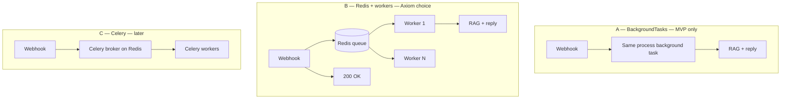
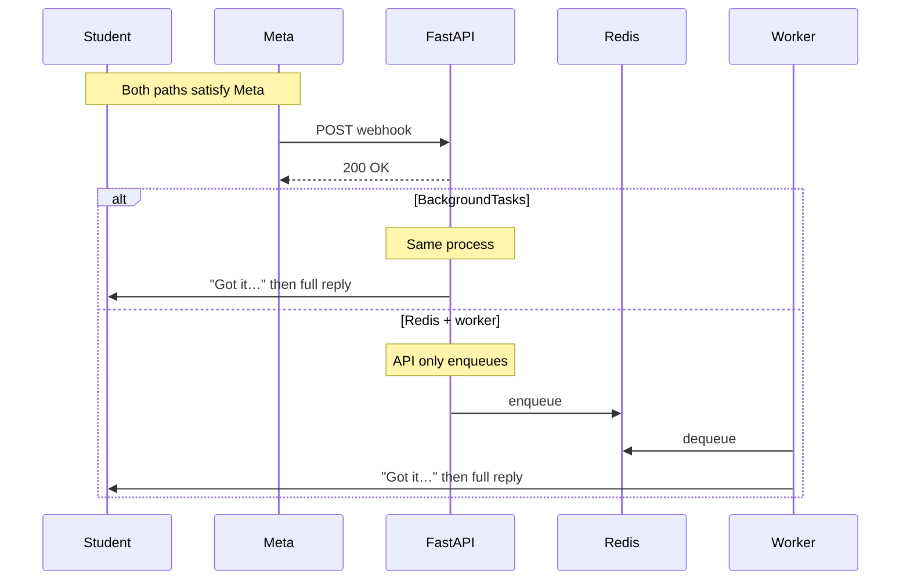
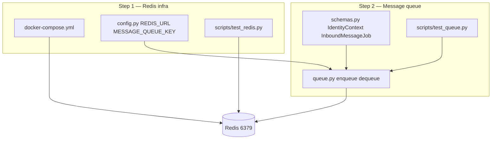
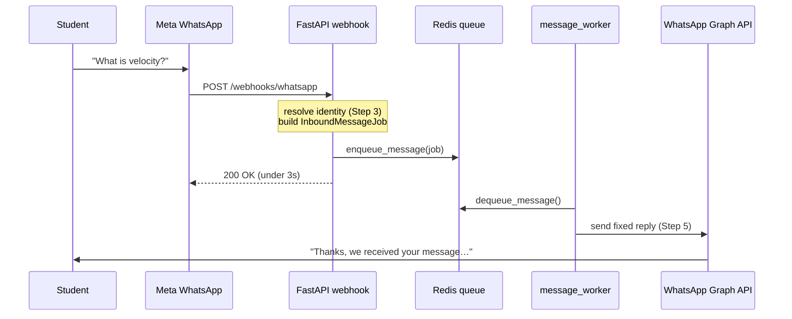

# Phase 1 — Redis & Message Queue

> **Layer:** Services / Messaging (+ infrastructure config)  
> **Depends on:** `infrastructure.config`, Redis (Docker), `redis` Python package  
> **Used by (later):** WhatsApp webhook (Step 4), message worker (Step 5), Phase 2 RAG  
> **Phase relevance:** Phase 1 Steps 1–2 (done); Steps 3–5 (webhook + worker) next  
> **Future:** Celery may replace the raw LIST worker in Phase 5–6 — **not used now**

---

## What this is for

When a student sends a WhatsApp message, **Meta requires your server to respond within ~3 seconds**. You cannot run RAG, LLM calls, or PDF processing inside the webhook.

**Solution:** decouple **receive** from **process**.

```text
Meta POST webhook  →  FastAPI enqueues job  →  200 OK (fast)
                              ↓
                         Redis LIST
                              ↓
                    Worker dequeues  →  send reply (slow path OK)
```

Phase 1 Steps 1–2 built the **middle layer**: Redis connection, config, typed job schema, and enqueue/dequeue functions. The webhook and worker are Steps 4–5.

---

## Mental model — read this if you feel confused

Most confusion comes from mixing **four different things**. Keep them separate:

| # | Piece | One sentence | Analogy |
|---|--------|----------------|---------|
| 1 | **Meta 200 OK** | HTTP response to Meta’s webhook POST — must be fast | Host says “order received” to delivery app |
| 2 | **Instant WhatsApp ack** | Optional text to student: “Got it, looking…” | Host texts customer “we’re on it” |
| 3 | **Queue (Redis)** | Mailbox that holds work until someone is free | Order rail in the kitchen |
| 4 | **Worker** | Background process that reads mailbox and does slow work | Chef(s) |

**Common mistake:** thinking Redis *is* the reply, or that you need Redis *only* to send “Sure, I’ll check…”.  
**Reality:** Redis is for **where work waits** and **who processes it** when you scale. The ack message is a **WhatsApp Graph API call** — you can send it from a worker (recommended) or from a background task.

### The only hard rule from Meta

```text
Your webhook HTTP handler must return 200 within ~3 seconds.
```

Everything after that can be slow — but **how** you run slow work determines scalability.

### Three valid architectures (same Meta rule)



**You are building B** because you said you want scalability. That is the right call for multi-tenant SaaS.

### What scales what?

| Bottleneck | Scale by… |
|------------|-----------|
| Many webhook POSTs/sec | More **API** replicas (all enqueue to same Redis) |
| Many messages waiting for AI | More **worker** replicas (all `BLPOP` same queue) |
| Slow RAG per message | Faster models, cache, instant ack UX — not tenant-specific Redis |
| PDF / OCR | Separate heavy queue or Celery (Phase 6) |

**You do not need one Redis queue per tenant** for scalability. You need **more workers** and **tenant id inside each job**.

---

## Redis vs FastAPI BackgroundTasks — full comparison

Both can satisfy Meta’s 200 OK. They differ in **what happens after** the response.

### How each works

#### FastAPI `BackgroundTasks`

```python
@router.post("/webhooks/whatsapp")
async def receive_webhook(background_tasks: BackgroundTasks, ...):
    job = build_job(...)
    background_tasks.add_task(handle_message, job)
    return {"status": "ok"}  # ← 200 sent FIRST, then handle_message runs
```

```text
One uvicorn process:
  Request thread → return 200
  Then → run handle_message in same process (thread pool)
```

#### Redis + worker (what Axiom builds)

```python
@router.post("/webhooks/whatsapp")
async def receive_webhook(...):
    job = build_job(...)
    enqueue_message(job)       # ← RPUSH ~1ms
    return {"status": "ok"}    # ← 200
```

```text
Process 1 (API):     enqueue only
Process 2..N (workers): BLPOP → RAG → WhatsApp send
```

### Side-by-side

| Criteria | FastAPI BackgroundTasks | Redis + worker(s) |
|----------|-------------------------|-------------------|
| **Meta 200 OK** | ✅ Returns before task runs | ✅ Returns after enqueue |
| **Instant “Got it…” ack** | ✅ Call Graph API in background task | ✅ Call Graph API as first step in worker |
| **Setup complexity** | Low — one process | Medium — API + Redis + worker(s) |
| **Durability** | ❌ Task lost if process crashes/restarts | ✅ Job stays in Redis until processed |
| **Retry on failure** | ❌ You build from scratch | ✅ Re-queue or Celery retries later |
| **Multiple API servers** | ⚠️ Each server runs its own background tasks; no shared backlog | ✅ All APIs push to one queue |
| **Scale AI throughput** | ❌ Limited by one machine’s process | ✅ Add worker containers |
| **Heavy jobs (OCR, PDF)** | ❌ Blocks/starves API process | ✅ Separate workers or queues |
| **Observability** | Hard — no queue depth | ✅ `queue_depth()`, metrics per tenant in logs |
| **Good for** | Solo dev, 1 tutor, demo | **Multi-tenant SaaS (Tutor AI SRS)** |

### Diagram — same student experience, different backend



### “Can I skip Redis and just send ack instantly?”

**Yes for a demo.** Pattern:

```python
async def handle_message(job):
    send_whatsapp(job.from_phone, "Sure, I'll check that for you…")
    answer = await run_rag(job)  # slow
    send_whatsapp(job.from_phone, answer)
```

That works with **BackgroundTasks** or a **worker**. The ack is not what forces Redis — **durability and scaling** do.

**For Tutor AI at scale:** put the same two messages in the **worker** so the API stays thin and you can run 10 workers after class.

### Decision record — why Axiom uses Redis

| Your goal | Choice |
|-----------|--------|
| Multi-tenant SaaS | Shared queue + `tenant_id` in job |
| Many students after class | Scale **workers**, not queues per tenant |
| NFR-RE-02 (queue on API failure) | Redis persists jobs |
| Phase 6 PDF/OCR | Workers/Celery — not API BackgroundTasks |
| Learning curve | Steps 1–2 already done — finish webhook + worker |

BackgroundTasks remains a valid **local fallback** if Redis is down during dev — not the production architecture.

---

## Scalability — workers, queue wait, and instant ack

### Does one queue mean the 100th student waits for 99 others?

**With one worker — yes.** With **N workers — roughly 1/N of the wait.**

```text
100 jobs, 2 seconds each:
  1 worker  → last student ~200s worst case
  10 workers → last student ~20s worst case
```

Workers are **separate processes** (same code: `python -m workers.message_worker`). Not one worker for the whole platform.

### Recommended production shape

```text
Load balancer
    → API × 2        (webhook + enqueue only)
    → Redis          (one cluster — Upstash / ElastiCache)
    → Workers × N    (RAG + WhatsApp — scale N with load)
```

### Best UX + scalable backend (hybrid)

```text
Worker step 1:  "Got it — I'm looking that up…"     (~1s)
Worker step 2:  RAG + LLM                            (~5–15s)
Worker step 3:  Full answer
```

Instant ack **does not replace** Redis — it makes the wait feel shorter while workers churn through the queue.

---

## Architecture (what exists today)



### Files map

| File | Role |
|------|------|
| `docker-compose.yml` | Runs Redis 7 locally |
| `src/infrastructure/config.py` | `REDIS_URL`, `MESSAGE_QUEUE_KEY` from `.env` |
| `src/services/messaging/schemas.py` | Pydantic models — job contract |
| `src/services/messaging/queue.py` | `enqueue_message`, `dequeue_message`, `queue_depth` |
| `scripts/test_redis.py` | Step 1 smoke test (PING + raw RPUSH/BLPOP) |
| `scripts/test_queue.py` | Step 2 smoke test (typed job round-trip) |
| `Makefile` | `make redis`, `make test-redis`, `make test-queue` |

### Dependency direction

```text
scripts/test_*.py
       ↓
services/messaging/queue.py  →  services/messaging/schemas.py
       ↓
infrastructure/config.py
       ↓
.env + docker-compose (Redis server)
```

**Correct:** messaging does not import FastAPI or WhatsApp yet. Queue is reusable.

---

## End-to-end user flow (target — Phase 1 complete)

This is the **full** flow once Steps 3–5 are wired. Steps 1–2 are the Redis + queue box in the middle.



**Today (Steps 1–2):** you can simulate the middle with `scripts/test_queue.py` — no Meta account required.

---

## Step 1 — Initialize Redis

### Why Docker Compose?

Every developer gets the same Redis version. Production will use managed Redis (Upstash, ElastiCache, etc.) — same `REDIS_URL` pattern.

```yaml
# docker-compose.yml
services:
  redis:
    image: redis:7-alpine
    ports:
      - "6379:6379"
    volumes:
      - redis_data:/data
    command: redis-server --appendonly yes
```

- **`appendonly yes`** — persists queue data across container restarts (AOF).
- **Port 6379** — default Redis; matches `REDIS_URL=redis://localhost:6379`.

**Commands:**

```bash
make redis          # docker compose up -d redis
make test-redis     # PING + RPUSH/BLPOP
```

### Config (`config.py`)

```python
REDIS_URL = os.getenv("REDIS_URL", "redis://localhost:6379")
MESSAGE_QUEUE_KEY = os.getenv("MESSAGE_QUEUE_KEY", "axiom:inbound_messages")
```

| Variable | Purpose |
|----------|---------|
| `REDIS_URL` | Connection string for `redis.Redis.from_url()` |
| `MESSAGE_QUEUE_KEY` | Redis LIST name — one queue for inbound WhatsApp jobs |

Both live in `.env` — never hardcode in `queue.py`.

### Step 1 test (`scripts/test_redis.py`)

Proves three things before you build abstractions:

1. **PING** — TCP + Redis protocol works  
2. **RPUSH** — append to tail of LIST (producer)  
3. **BLPOP** — blocking pop from head (consumer)

Uses raw JSON `{"step": 1, "test": true}` — no Pydantic yet.

**Critical detail:** `decode_responses=True` so Redis returns `str`, not `bytes`. JSON parsing breaks without it.

---

## Step 2 — Job schema + queue functions

### Why Pydantic models?

The webhook and worker are **separate processes**. They must agree on JSON shape. Pydantic validates on read and gives you `.model_dump_json()` on write.

### `IdentityContext` (`schemas.py`)

Who sent the message — carried to RAG in Phase 2.

```python
class IdentityContext(BaseModel):
    role: Literal["student", "staff", "unknown"] = "student"
    tenant_id: str
    student_id: str | None = None
    staff_id: str | None = None
    class_ids: list[str] = Field(default_factory=list)
```

| Field | Phase 1 | Phase 3+ |
|-------|---------|----------|
| `tenant_id` | Stub from env | Supabase enrollment |
| `class_ids` | Stub list | Student's registered classes |
| `role` | Always `student` stub | student vs staff lookup |

**Design rule:** RAG must read `job.identity.tenant_id` and `job.identity.class_ids` — never `DEFAULT_TENANT_ID` from env at query time (production).

### `InboundMessageJob` (`schemas.py`)

One queued WhatsApp message:

```python
class InboundMessageJob(BaseModel):
    message_id: str          # Meta wamid.xxx
    from_phone: str          # 94771234567 (no +)
    text: str
    received_at: float       # Unix timestamp
    channel: Literal["whatsapp"] = "whatsapp"
    identity: IdentityContext
    raw_metadata: dict[str, Any] = Field(default_factory=dict)
```

Example JSON in Redis:

```json
{
  "message_id": "wamid.test001",
  "from_phone": "94771234567",
  "text": "What is velocity?",
  "received_at": 1710000000.0,
  "channel": "whatsapp",
  "identity": {
    "role": "student",
    "tenant_id": "dev-tenant-001",
    "student_id": "stu-dev-001",
    "staff_id": null,
    "class_ids": ["physics-al-2026"]
  },
  "raw_metadata": {"phone_number_id": "111"}
}
```

### `queue.py` — three operations

#### 1. `get_redis_client()` — singleton

Same pattern as `get_qdrant_client()`:

- Create client once per process  
- `ping()` on first connect  
- `decode_responses=True`

#### 2. `enqueue_message(job)` — producer (webhook will call this)

```python
client.rpush(MESSAGE_QUEUE_KEY, job.model_dump_json())
```

- **RPUSH** — add to tail → FIFO with BLPOP from head  
- Logs `message_id`, `from_phone`, `tenant_id`

#### 3. `dequeue_message(timeout_seconds=5)` — consumer (worker will call this)

```python
result = client.blpop(MESSAGE_QUEUE_KEY, timeout=timeout_seconds)
job = InboundMessageJob.model_validate_json(raw)
```

- **BLPOP** — blocks until a job exists (worker loop friendly)  
- Returns `None` on timeout — worker can check shutdown flags and loop  
- **validate_json** — reject corrupted queue entries early

#### 4. `queue_depth()` — observability

```python
client.llen(MESSAGE_QUEUE_KEY)
```

Pending job count for health checks / alerts (Phase 5).

### Step 2 test (`scripts/test_queue.py`)

Builds a fake `InboundMessageJob`, enqueues, checks depth ≥ 1, dequeues, asserts all fields match.

```bash
make test-queue
```

---

## Code flow walkthrough (developer)

### Enqueue path (future webhook)

```python
from services.identity.resolver import resolve_identity  # Step 3
from services.messaging.queue import enqueue_message
from services.messaging.schemas import InboundMessageJob

identity = resolve_identity(from_phone="94771234567")

job = InboundMessageJob(
    message_id="wamid.xxx",
    from_phone="94771234567",
    text="What is velocity?",
    received_at=time.time(),
    identity=identity,
)

enqueue_message(job)  # → Redis, returns immediately
```

### Dequeue path (future worker)

```python
from services.messaging.queue import dequeue_message

job = dequeue_message(timeout_seconds=5)
if job is None:
    continue  # no work yet

# Phase 1: send fixed reply
# Phase 2: RAG using job.text + job.identity.tenant_id + job.identity.class_ids
print(job.text, job.identity.class_ids)
```

---

## Redis LIST vs other patterns

| Mechanism | What we use | Notes |
|-----------|-------------|-------|
| **LIST + RPUSH/BLPOP** | ✅ Phase 1 | Simple FIFO, one consumer group, easy to debug |
| **Pub/Sub** | ❌ | Fire-and-forget — no persistence if worker is down |
| **Streams** | Later option | Consumer groups, acks — closer to Celery semantics |
| **Celery broker** | Phase 5–6 | Same Redis server, different key layout + worker process |

---

## Celery — later, not now

**Celery** is a task queue framework (retries, schedules, multiple task types). It fits Tutor AI for:

- PDF ingest (Phase 6)  
- Payment slip OCR (Phase 6)  
- Class reminders (cron)  
- Automatic retry when WhatsApp Graph API fails  

**Why we didn't start with Celery:**

- Phase 1 goal is to **understand** webhook → queue → worker with ~60 lines of clear code  
- Same `InboundMessageJob` schema migrates cleanly: `process_message.delay(job.model_dump())`  
- Adding Celery before the pipeline exists hides the mechanics

**Migration path (when ready):**

```text
enqueue_message(job)     →  celery_app.send_task("process_inbound", args=[job.model_dump()])
message_worker.py loop   →  celery worker -A workers.celery_app
InboundMessageJob schema →  unchanged
```

Record this in architecture docs — **queue contract stays; transport may swap to Celery.**

---

## What's next (Phase 1 Steps 3–5)

| Step | Build | Uses queue? |
|------|-------|-------------|
| **3** | `services/identity/resolver.py` — stub phone → `IdentityContext` | Feeds job before enqueue |
| **4** | `api/main.py` + `api/webhooks/whatsapp.py` | Calls `enqueue_message` |
| **5** | `workers/message_worker.py` + WhatsApp send client | Calls `dequeue_message` |

---

## Makefile reference

```bash
make redis        # start Redis container
make test-redis   # Step 1 — connection + raw LIST
make test-queue   # Step 2 — typed job round-trip
```

---

## Common mistakes

| Symptom | Cause | Fix |
|---------|-------|-----|
| `Connection refused` | Redis not running | `make redis` |
| `ModuleNotFoundError: redis` | Package not installed | `uv pip install redis` |
| JSON / validation errors on dequeue | `decode_responses=False` | Use `True` in client |
| `bytes` in queue values | Same as above | Recreate client with decode |
| Jobs lost on restart (dev) | No volume | `docker-compose.yml` has `redis_data` volume |
| Wrong tenant in RAG | Reading env in worker | Use `job.identity.tenant_id` |

---

## Self-check

1. What Redis command does the webhook use? → **RPUSH** (via `enqueue_message`)  
2. What command does the worker use? → **BLPOP** (via `dequeue_message`)  
3. Why not process AI in the webhook? → **Meta 3-second timeout**  
4. Where is `tenant_id` stored for Phase 2 RAG? → **`job.identity.tenant_id`** in queue payload  
5. Celery in Phase 1? → **No** — raw LIST first; Celery Phase 5–6 for retries/cron/heavy tasks  
6. How to verify locally? → **`make test-redis`** then **`make test-queue`**  
7. BackgroundTasks instead of Redis? → **OK for MVP**; **Redis + workers for scalable SaaS**  
8. One worker forever? → **No** — run N worker processes in production  
9. Instant ack need Redis? → **No** — but send ack from **worker** in production  

---

*Last updated: July 2026 — Phase 1 Steps 1–2 (+ Redis vs BackgroundTasks, scalability)*
